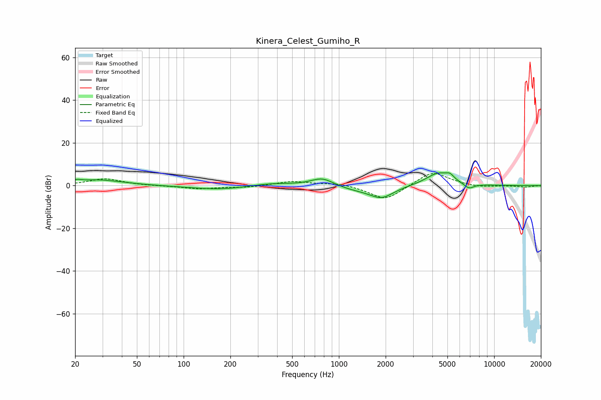

# Kinera_Celest_Gumiho_R
See [usage instructions](https://github.com/jaakkopasanen/AutoEq#usage) for more options and info.

### Parametric EQs
Apply preamp of -6.1 dB when using parametric equalizer.

|   # | Type    |   Fc (Hz) |    Q |   Gain (dB) |
|-----|---------|-----------|------|-------------|
|   1 | Peaking |        21 | 5.55 |         0.9 |
|   2 | Peaking |        28 | 0.87 |         2.7 |
|   3 | Peaking |       173 | 0.71 |        -1.9 |
|   4 | Peaking |       358 | 1    |         1.4 |
|   5 | Peaking |       781 | 1.92 |         3.9 |
|   6 | Peaking |      1250 | 1.17 |        -1.6 |
|   7 | Peaking |      1882 | 1.77 |        -5.6 |
|   8 | Peaking |      4386 | 1.72 |         6.1 |
|   9 | Peaking |      5196 | 5.66 |         2.1 |
|  10 | Peaking |      6876 | 4.13 |        -2.5 |

### Fixed Band EQs
When using fixed band (also called graphic) equalizer, apply preamp of **-5.8 dB** (if available) and set gains manually with these parameters.

|   # | Type    |   Fc (Hz) |    Q |   Gain (dB) |
|-----|---------|-----------|------|-------------|
|   1 | Peaking |        31 | 1.41 |         3.2 |
|   2 | Peaking |        62 | 1.41 |        -0.1 |
|   3 | Peaking |       125 | 1.41 |        -1.5 |
|   4 | Peaking |       250 | 1.41 |        -0.8 |
|   5 | Peaking |       500 | 1.41 |         2   |
|   6 | Peaking |      1000 | 1.41 |         1.3 |
|   7 | Peaking |      2000 | 1.41 |        -7.1 |
|   8 | Peaking |      4000 | 1.41 |         7   |
|   9 | Peaking |      8000 | 1.41 |        -0.9 |
|  10 | Peaking |     16000 | 1.41 |        -0.7 |

### Graphs

