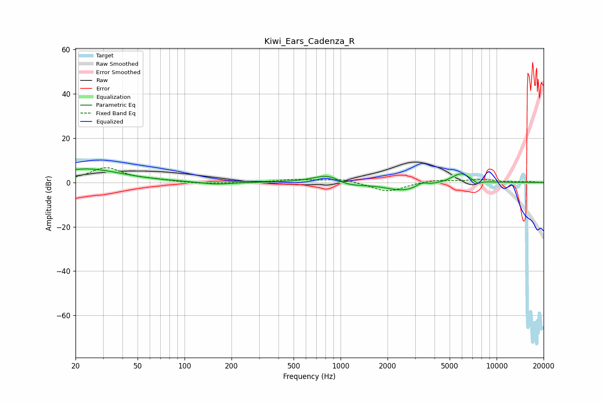

# Kiwi_Ears_Cadenza_R
See [usage instructions](https://github.com/jaakkopasanen/AutoEq#usage) for more options and info.

### Parametric EQs
Apply preamp of -6.2 dB when using parametric equalizer.

|   # | Type    |   Fc (Hz) |    Q |   Gain (dB) |
|-----|---------|-----------|------|-------------|
|   1 | Peaking |        24 | 0.64 |         6.1 |
|   2 | Peaking |       158 | 1.54 |        -1.1 |
|   3 | Peaking |       843 | 1.49 |         4.1 |
|   4 | Peaking |      1042 | 2.19 |        -1.4 |
|   5 | Peaking |      1225 | 1.62 |        -1.2 |
|   6 | Peaking |      2498 | 1.19 |        -3.6 |
|   7 | Peaking |      3209 | 5.79 |         0.8 |
|   8 | Peaking |      3415 | 4.84 |         1   |
|   9 | Peaking |      5915 | 2.27 |         4.5 |
|  10 | Peaking |      7553 | 5.11 |        -1.6 |

### Fixed Band EQs
When using fixed band (also called graphic) equalizer, apply preamp of **-6.8 dB** (if available) and set gains manually with these parameters.

|   # | Type    |   Fc (Hz) |    Q |   Gain (dB) |
|-----|---------|-----------|------|-------------|
|   1 | Peaking |        31 | 1.41 |         6.5 |
|   2 | Peaking |        62 | 1.41 |         0.8 |
|   3 | Peaking |       125 | 1.41 |        -0.6 |
|   4 | Peaking |       250 | 1.41 |        -0.3 |
|   5 | Peaking |       500 | 1.41 |         1.2 |
|   6 | Peaking |      1000 | 1.41 |         1.7 |
|   7 | Peaking |      2000 | 1.41 |        -4.3 |
|   8 | Peaking |      4000 | 1.41 |         1.3 |
|   9 | Peaking |      8000 | 1.41 |         1.3 |
|  10 | Peaking |     16000 | 1.41 |         0.4 |

### Graphs

