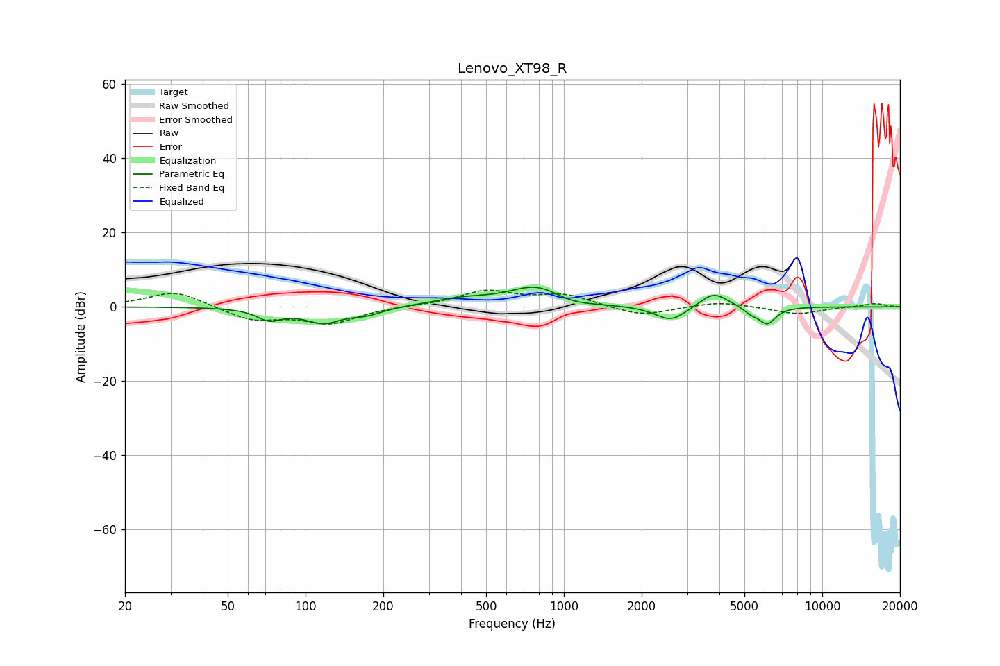

# Lenovo_XT98_R
See [usage instructions](https://github.com/jaakkopasanen/AutoEq#usage) for more options and info.

### Parametric EQs
Apply preamp of -5.4 dB when using parametric equalizer.

|   # | Type    |   Fc (Hz) |    Q |   Gain (dB) |
|-----|---------|-----------|------|-------------|
|   1 | Peaking |        72 | 2.96 |        -3   |
|   2 | Peaking |       117 | 1.94 |        -4   |
|   3 | Peaking |       173 | 2.32 |        -1.7 |
|   4 | Peaking |       399 | 1.24 |         1.7 |
|   5 | Peaking |       792 | 1.3  |         5.8 |
|   6 | Peaking |      1049 | 1.63 |        -1.8 |
|   7 | Peaking |      2599 | 2.32 |        -4.1 |
|   8 | Peaking |      3801 | 2.53 |         4.2 |
|   9 | Peaking |      5295 | 4.73 |        -1.5 |
|  10 | Peaking |      6125 | 4.14 |        -4.5 |

### Fixed Band EQs
When using fixed band (also called graphic) equalizer, apply preamp of **-4.6 dB** (if available) and set gains manually with these parameters.

|   # | Type    |   Fc (Hz) |    Q |   Gain (dB) |
|-----|---------|-----------|------|-------------|
|   1 | Peaking |        31 | 1.41 |         4.4 |
|   2 | Peaking |        62 | 1.41 |        -3.6 |
|   3 | Peaking |       125 | 1.41 |        -4.3 |
|   4 | Peaking |       250 | 1.41 |         0.2 |
|   5 | Peaking |       500 | 1.41 |         4.1 |
|   6 | Peaking |      1000 | 1.41 |         3.1 |
|   7 | Peaking |      2000 | 1.41 |        -2.6 |
|   8 | Peaking |      4000 | 1.41 |         1.5 |
|   9 | Peaking |      8000 | 1.41 |        -2   |
|  10 | Peaking |     16000 | 1.41 |         0.9 |

### Graphs

