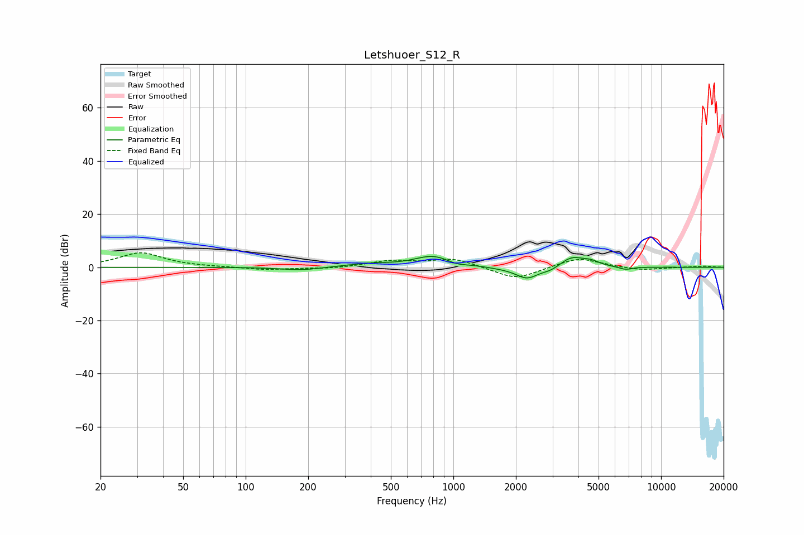

# Letshuoer_S12_R
See [usage instructions](https://github.com/jaakkopasanen/AutoEq#usage) for more options and info.

### Parametric EQs
Apply preamp of -4.2 dB when using parametric equalizer.

|   # | Type    |   Fc (Hz) |    Q |   Gain (dB) |
|-----|---------|-----------|------|-------------|
|   1 | Peaking |       184 | 1.52 |        -1.2 |
|   2 | Peaking |       394 | 1.37 |         1.2 |
|   3 | Peaking |       795 | 1.59 |         4.2 |
|   4 | Peaking |      1033 | 3.57 |        -0.9 |
|   5 | Peaking |      1719 | 2.33 |        -0.3 |
|   6 | Peaking |      2263 | 2.57 |        -4.4 |
|   7 | Peaking |      2939 | 3.53 |        -1.3 |
|   8 | Peaking |      3725 | 2.43 |         3.9 |
|   9 | Peaking |      4608 | 3.54 |         1.6 |
|  10 | Peaking |      6756 | 4.1  |        -1.1 |

### Fixed Band EQs
When using fixed band (also called graphic) equalizer, apply preamp of **-5.5 dB** (if available) and set gains manually with these parameters.

|   # | Type    |   Fc (Hz) |    Q |   Gain (dB) |
|-----|---------|-----------|------|-------------|
|   1 | Peaking |        31 | 1.41 |         5.5 |
|   2 | Peaking |        62 | 1.41 |         0.1 |
|   3 | Peaking |       125 | 1.41 |        -1   |
|   4 | Peaking |       250 | 1.41 |        -0.6 |
|   5 | Peaking |       500 | 1.41 |         2.3 |
|   6 | Peaking |      1000 | 1.41 |         3.3 |
|   7 | Peaking |      2000 | 1.41 |        -4.8 |
|   8 | Peaking |      4000 | 1.41 |         3.8 |
|   9 | Peaking |      8000 | 1.41 |        -1.2 |
|  10 | Peaking |     16000 | 1.41 |         0.5 |

### Graphs

