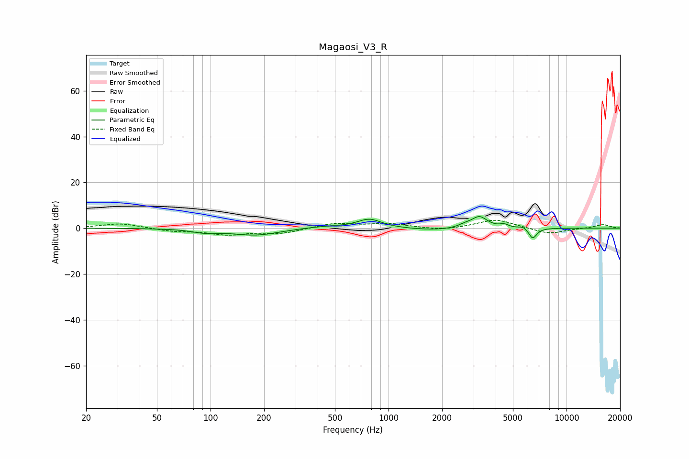

# Magaosi_V3_R
See [usage instructions](https://github.com/jaakkopasanen/AutoEq#usage) for more options and info.

### Parametric EQs
Apply preamp of -5.2 dB when using parametric equalizer.

|   # | Type    |   Fc (Hz) |    Q |   Gain (dB) |
|-----|---------|-----------|------|-------------|
|   1 | Peaking |        93 | 1.94 |        -1.5 |
|   2 | Peaking |       179 | 1.09 |        -3   |
|   3 | Peaking |       433 | 1.19 |         0.8 |
|   4 | Peaking |       782 | 2.08 |         4   |
|   5 | Peaking |      1829 | 0.99 |        -1   |
|   6 | Peaking |      2679 | 3.86 |         1.1 |
|   7 | Peaking |      3239 | 3.17 |         5.1 |
|   8 | Peaking |      4465 | 6    |         1.3 |
|   9 | Peaking |      5706 | 6    |         1.1 |
|  10 | Peaking |      6458 | 6    |        -4.7 |

### Fixed Band EQs
When using fixed band (also called graphic) equalizer, apply preamp of **-3.5 dB** (if available) and set gains manually with these parameters.

|   # | Type    |   Fc (Hz) |    Q |   Gain (dB) |
|-----|---------|-----------|------|-------------|
|   1 | Peaking |        31 | 1.41 |         2.1 |
|   2 | Peaking |        62 | 1.41 |        -1.3 |
|   3 | Peaking |       125 | 1.41 |        -2.6 |
|   4 | Peaking |       250 | 1.41 |        -2.2 |
|   5 | Peaking |       500 | 1.41 |         2.2 |
|   6 | Peaking |      1000 | 1.41 |         1.8 |
|   7 | Peaking |      2000 | 1.41 |        -1.1 |
|   8 | Peaking |      4000 | 1.41 |         3.9 |
|   9 | Peaking |      8000 | 1.41 |        -2.6 |
|  10 | Peaking |     16000 | 1.41 |         1.6 |

### Graphs

