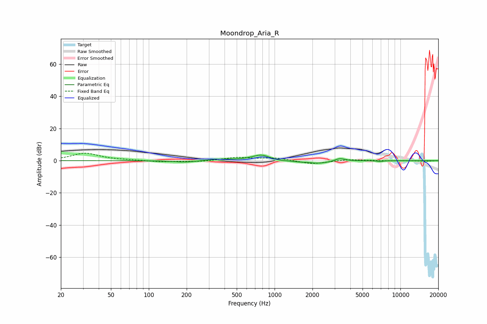

# Moondrop_Aria_R
See [usage instructions](https://github.com/jaakkopasanen/AutoEq#usage) for more options and info.

### Parametric EQs
Apply preamp of -3.5 dB when using parametric equalizer.

|   # | Type    |   Fc (Hz) |    Q |   Gain (dB) |
|-----|---------|-----------|------|-------------|
|   1 | Peaking |       193 | 1.53 |        -1   |
|   2 | Peaking |       228 | 1.17 |        -0.2 |
|   3 | Peaking |       361 | 1.06 |         0.9 |
|   4 | Peaking |       783 | 2.01 |         3.4 |
|   5 | Peaking |       836 | 1.91 |         0.4 |
|   6 | Peaking |      1050 | 1.72 |        -0.7 |
|   7 | Peaking |      1542 | 4.39 |        -0.3 |
|   8 | Peaking |      2240 | 1.44 |        -1.8 |
|   9 | Peaking |      3302 | 3.46 |         1.9 |
|  10 | Peaking |      6881 | 6    |        -0.5 |

### Fixed Band EQs
When using fixed band (also called graphic) equalizer, apply preamp of **-4.7 dB** (if available) and set gains manually with these parameters.

|   # | Type    |   Fc (Hz) |    Q |   Gain (dB) |
|-----|---------|-----------|------|-------------|
|   1 | Peaking |        31 | 1.41 |         4.6 |
|   2 | Peaking |        62 | 1.41 |         0.3 |
|   3 | Peaking |       125 | 1.41 |        -0.7 |
|   4 | Peaking |       250 | 1.41 |        -0.7 |
|   5 | Peaking |       500 | 1.41 |         1.9 |
|   6 | Peaking |      1000 | 1.41 |         1.7 |
|   7 | Peaking |      2000 | 1.41 |        -2.2 |
|   8 | Peaking |      4000 | 1.41 |         0.8 |
|   9 | Peaking |      8000 | 1.41 |        -0.1 |
|  10 | Peaking |     16000 | 1.41 |        -0.3 |

### Graphs

