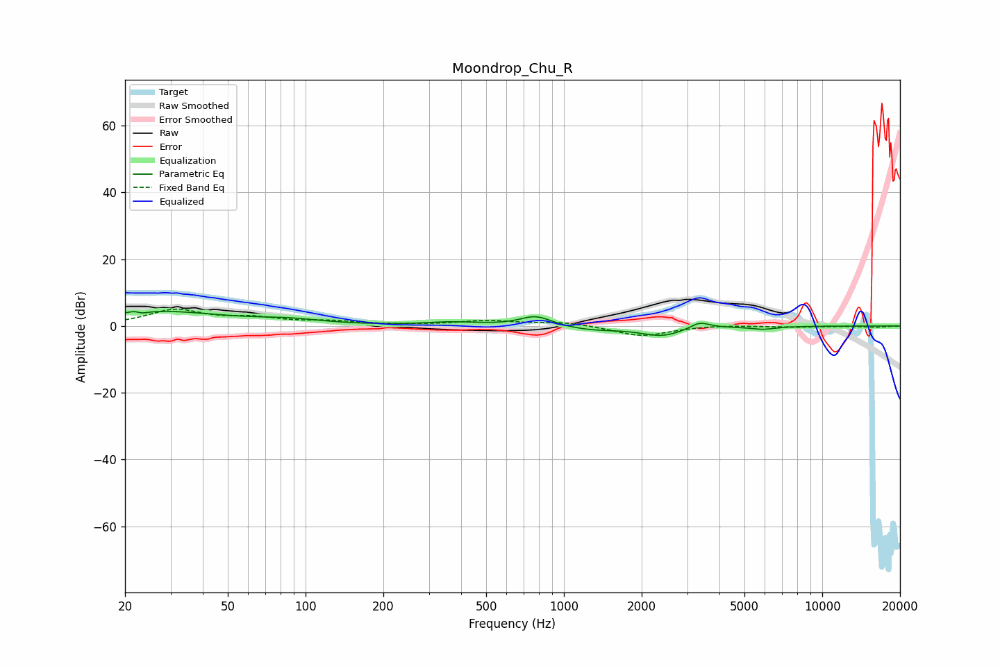

# Moondrop_Chu_R
See [usage instructions](https://github.com/jaakkopasanen/AutoEq#usage) for more options and info.

### Parametric EQs
Apply preamp of -4.5 dB when using parametric equalizer.

|   # | Type    |   Fc (Hz) |    Q |   Gain (dB) |
|-----|---------|-----------|------|-------------|
|   1 | Peaking |        22 | 5.9  |         3.1 |
|   2 | Peaking |        23 | 5.88 |        -3.2 |
|   3 | Peaking |        27 | 0.59 |         4.3 |
|   4 | Peaking |        86 | 1.07 |         1.3 |
|   5 | Peaking |       371 | 1.36 |         1   |
|   6 | Peaking |       778 | 2.3  |         3.1 |
|   7 | Peaking |      1273 | 1.3  |        -1.2 |
|   8 | Peaking |      2398 | 1.71 |        -2.8 |
|   9 | Peaking |      3354 | 3.7  |         2.1 |
|  10 | Peaking |      5893 | 2.87 |        -0.9 |

### Fixed Band EQs
When using fixed band (also called graphic) equalizer, apply preamp of **-5.1 dB** (if available) and set gains manually with these parameters.

|   # | Type    |   Fc (Hz) |    Q |   Gain (dB) |
|-----|---------|-----------|------|-------------|
|   1 | Peaking |        31 | 1.41 |         4.6 |
|   2 | Peaking |        62 | 1.41 |         2   |
|   3 | Peaking |       125 | 1.41 |         1.1 |
|   4 | Peaking |       250 | 1.41 |         0.2 |
|   5 | Peaking |       500 | 1.41 |         1.5 |
|   6 | Peaking |      1000 | 1.41 |         1.2 |
|   7 | Peaking |      2000 | 1.41 |        -3.1 |
|   8 | Peaking |      4000 | 1.41 |         0.4 |
|   9 | Peaking |      8000 | 1.41 |        -0.3 |
|  10 | Peaking |     16000 | 1.41 |        -0.3 |

### Graphs

