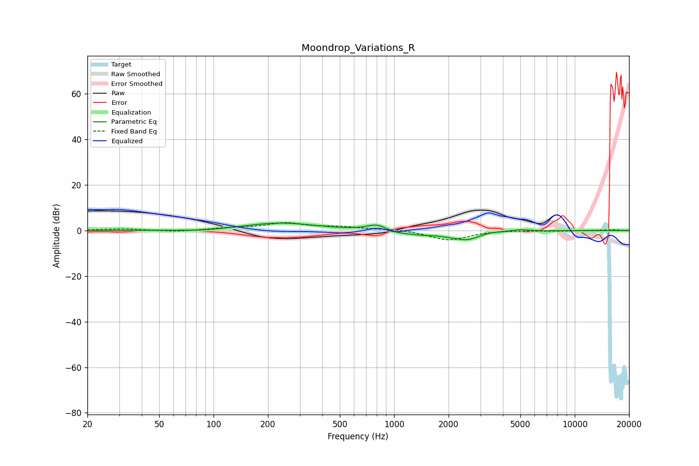

# Moondrop_Variations_R
See [usage instructions](https://github.com/jaakkopasanen/AutoEq#usage) for more options and info.

### Parametric EQs
Apply preamp of -3.3 dB when using parametric equalizer.

|   # | Type    |   Fc (Hz) |    Q |   Gain (dB) |
|-----|---------|-----------|------|-------------|
|   1 | Peaking |        86 | 1.3  |        -0.6 |
|   2 | Peaking |       234 | 0.74 |         3.3 |
|   3 | Peaking |       770 | 2.18 |         0.8 |
|   4 | Peaking |       808 | 2.95 |         2.1 |
|   5 | Peaking |      1069 | 1.57 |        -1.3 |
|   6 | Peaking |      1425 | 2.95 |        -0.5 |
|   7 | Peaking |      2503 | 1.13 |        -4   |
|   8 | Peaking |      2622 | 2.77 |        -1   |
|   9 | Peaking |      3252 | 1.57 |         1.7 |
|  10 | Peaking |      4994 | 2.79 |         0.8 |

### Fixed Band EQs
When using fixed band (also called graphic) equalizer, apply preamp of **-3.5 dB** (if available) and set gains manually with these parameters.

|   # | Type    |   Fc (Hz) |    Q |   Gain (dB) |
|-----|---------|-----------|------|-------------|
|   1 | Peaking |        31 | 1.41 |         0.7 |
|   2 | Peaking |        62 | 1.41 |        -0.6 |
|   3 | Peaking |       125 | 1.41 |         1   |
|   4 | Peaking |       250 | 1.41 |         3   |
|   5 | Peaking |       500 | 1.41 |         1.4 |
|   6 | Peaking |      1000 | 1.41 |         0.7 |
|   7 | Peaking |      2000 | 1.41 |        -4.3 |
|   8 | Peaking |      4000 | 1.41 |         0.2 |
|   9 | Peaking |      8000 | 1.41 |        -0.2 |
|  10 | Peaking |     16000 | 1.41 |         0.3 |

### Graphs

