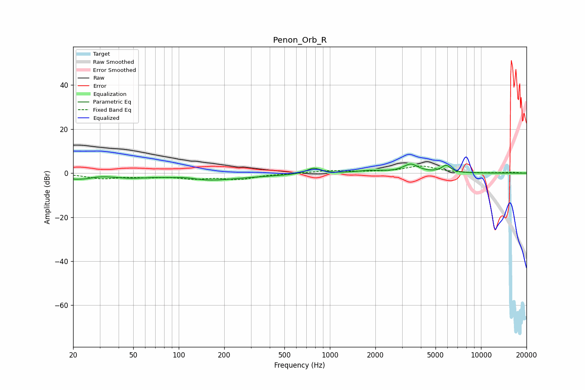

# Penon_Orb_R
See [usage instructions](https://github.com/jaakkopasanen/AutoEq#usage) for more options and info.

### Parametric EQs
Apply preamp of -4.2 dB when using parametric equalizer.

|   # | Type    |   Fc (Hz) |    Q |   Gain (dB) |
|-----|---------|-----------|------|-------------|
|   1 | Peaking |        20 | 5.13 |        -1.2 |
|   2 | Peaking |        24 | 2.54 |        -1.8 |
|   3 | Peaking |        47 | 1.19 |        -1.7 |
|   4 | Peaking |       113 | 2.29 |         0.7 |
|   5 | Peaking |       151 | 0.75 |        -2.6 |
|   6 | Peaking |       302 | 0.45 |        -0.9 |
|   7 | Peaking |       782 | 3.08 |         2.7 |
|   8 | Peaking |      1846 | 1.55 |         1.1 |
|   9 | Peaking |      3430 | 2.83 |         3.8 |
|  10 | Peaking |      5881 | 4.49 |         3.2 |

### Fixed Band EQs
When using fixed band (also called graphic) equalizer, apply preamp of **-3.3 dB** (if available) and set gains manually with these parameters.

|   # | Type    |   Fc (Hz) |    Q |   Gain (dB) |
|-----|---------|-----------|------|-------------|
|   1 | Peaking |        31 | 1.41 |        -2.3 |
|   2 | Peaking |        62 | 1.41 |        -1.3 |
|   3 | Peaking |       125 | 1.41 |        -2   |
|   4 | Peaking |       250 | 1.41 |        -2.5 |
|   5 | Peaking |       500 | 1.41 |        -0.2 |
|   6 | Peaking |      1000 | 1.41 |         1.2 |
|   7 | Peaking |      2000 | 1.41 |         0.4 |
|   8 | Peaking |      4000 | 1.41 |         3.1 |
|   9 | Peaking |      8000 | 1.41 |        -0.1 |
|  10 | Peaking |     16000 | 1.41 |         0.4 |

### Graphs

