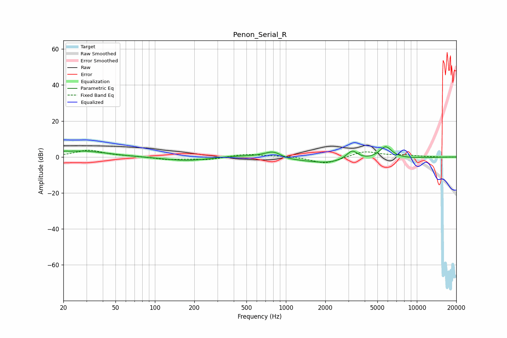

# Penon_Serial_R
See [usage instructions](https://github.com/jaakkopasanen/AutoEq#usage) for more options and info.

### Parametric EQs
Apply preamp of -5.7 dB when using parametric equalizer.

|   # | Type    |   Fc (Hz) |    Q |   Gain (dB) |
|-----|---------|-----------|------|-------------|
|   1 | Peaking |        20 | 5.19 |         0.5 |
|   2 | Peaking |        28 | 0.73 |         3.3 |
|   3 | Peaking |       178 | 0.78 |        -2.5 |
|   4 | Peaking |       453 | 0.56 |         1.4 |
|   5 | Peaking |       806 | 2.04 |         4   |
|   6 | Peaking |       997 | 2.17 |        -0.8 |
|   7 | Peaking |      2024 | 1.56 |        -0.8 |
|   8 | Peaking |      2329 | 0.35 |        -3.1 |
|   9 | Peaking |      3205 | 3.09 |         5.7 |
|  10 | Peaking |      5764 | 2.68 |         7.3 |

### Fixed Band EQs
When using fixed band (also called graphic) equalizer, apply preamp of **-3.8 dB** (if available) and set gains manually with these parameters.

|   # | Type    |   Fc (Hz) |    Q |   Gain (dB) |
|-----|---------|-----------|------|-------------|
|   1 | Peaking |        31 | 1.41 |         3.7 |
|   2 | Peaking |        62 | 1.41 |         0.3 |
|   3 | Peaking |       125 | 1.41 |        -1.4 |
|   4 | Peaking |       250 | 1.41 |        -1.5 |
|   5 | Peaking |       500 | 1.41 |         1.6 |
|   6 | Peaking |      1000 | 1.41 |         0.6 |
|   7 | Peaking |      2000 | 1.41 |        -3.9 |
|   8 | Peaking |      4000 | 1.41 |         3.3 |
|   9 | Peaking |      8000 | 1.41 |         0.9 |
|  10 | Peaking |     16000 | 1.41 |        -0.2 |

### Graphs

