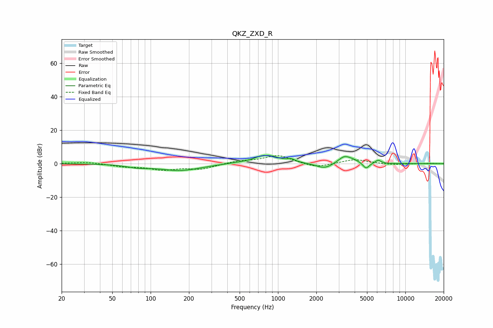

# QKZ_ZXD_R
See [usage instructions](https://github.com/jaakkopasanen/AutoEq#usage) for more options and info.

### Parametric EQs
Apply preamp of -5.0 dB when using parametric equalizer.

|   # | Type    |   Fc (Hz) |    Q |   Gain (dB) |
|-----|---------|-----------|------|-------------|
|   1 | Peaking |        79 | 1.72 |        -1.5 |
|   2 | Peaking |       171 | 0.86 |        -4.1 |
|   3 | Peaking |       602 | 2.77 |        -0.6 |
|   4 | Peaking |       789 | 1.3  |         5.4 |
|   5 | Peaking |      1274 | 5.37 |         1.4 |
|   6 | Peaking |      2318 | 2.12 |        -3.4 |
|   7 | Peaking |      3309 | 2.92 |         4.2 |
|   8 | Peaking |      3867 | 2.64 |         1.5 |
|   9 | Peaking |      4915 | 5.75 |        -3.7 |
|  10 | Peaking |      6099 | 6    |         2.1 |

### Fixed Band EQs
When using fixed band (also called graphic) equalizer, apply preamp of **-4.9 dB** (if available) and set gains manually with these parameters.

|   # | Type    |   Fc (Hz) |    Q |   Gain (dB) |
|-----|---------|-----------|------|-------------|
|   1 | Peaking |        31 | 1.41 |         1   |
|   2 | Peaking |        62 | 1.41 |        -1.6 |
|   3 | Peaking |       125 | 1.41 |        -3.3 |
|   4 | Peaking |       250 | 1.41 |        -3   |
|   5 | Peaking |       500 | 1.41 |         1.5 |
|   6 | Peaking |      1000 | 1.41 |         5   |
|   7 | Peaking |      2000 | 1.41 |        -2.7 |
|   8 | Peaking |      4000 | 1.41 |         2.6 |
|   9 | Peaking |      8000 | 1.41 |        -0.7 |
|  10 | Peaking |     16000 | 1.41 |         0.2 |

### Graphs

