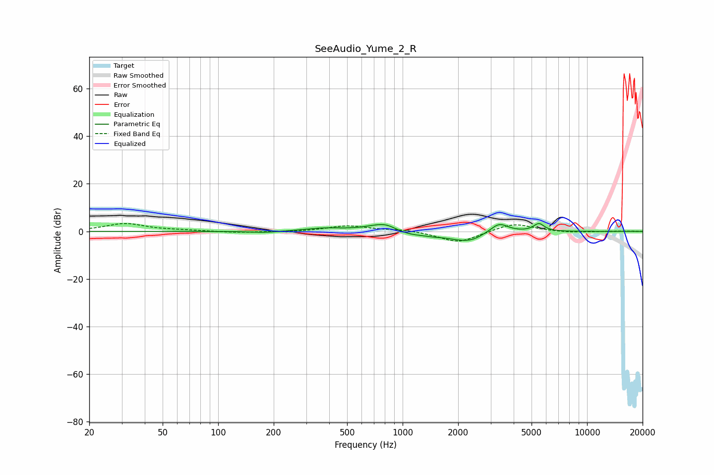

# SeeAudio_Yume_2_R
See [usage instructions](https://github.com/jaakkopasanen/AutoEq#usage) for more options and info.

### Parametric EQs
Apply preamp of -3.4 dB when using parametric equalizer.

|   # | Type    |   Fc (Hz) |    Q |   Gain (dB) |
|-----|---------|-----------|------|-------------|
|   1 | Peaking |       179 | 1.7  |        -0.6 |
|   2 | Peaking |       376 | 1.31 |         1.2 |
|   3 | Peaking |       772 | 1.65 |         3.2 |
|   4 | Peaking |       825 | 3.67 |         0.7 |
|   5 | Peaking |      1090 | 1.58 |        -1.8 |
|   6 | Peaking |      1468 | 3.27 |        -0.5 |
|   7 | Peaking |      2163 | 1.41 |        -3.8 |
|   8 | Peaking |      2406 | 3.32 |        -0.7 |
|   9 | Peaking |      3334 | 2.89 |         4.2 |
|  10 | Peaking |      5481 | 4.76 |         3.3 |

### Fixed Band EQs
When using fixed band (also called graphic) equalizer, apply preamp of **-3.4 dB** (if available) and set gains manually with these parameters.

|   # | Type    |   Fc (Hz) |    Q |   Gain (dB) |
|-----|---------|-----------|------|-------------|
|   1 | Peaking |        31 | 1.41 |         3.3 |
|   2 | Peaking |        62 | 1.41 |         0.4 |
|   3 | Peaking |       125 | 1.41 |        -0.5 |
|   4 | Peaking |       250 | 1.41 |        -0.2 |
|   5 | Peaking |       500 | 1.41 |         2.4 |
|   6 | Peaking |      1000 | 1.41 |         0.8 |
|   7 | Peaking |      2000 | 1.41 |        -4.9 |
|   8 | Peaking |      4000 | 1.41 |         3.6 |
|   9 | Peaking |      8000 | 1.41 |        -0.5 |
|  10 | Peaking |     16000 | 1.41 |         0.1 |

### Graphs

