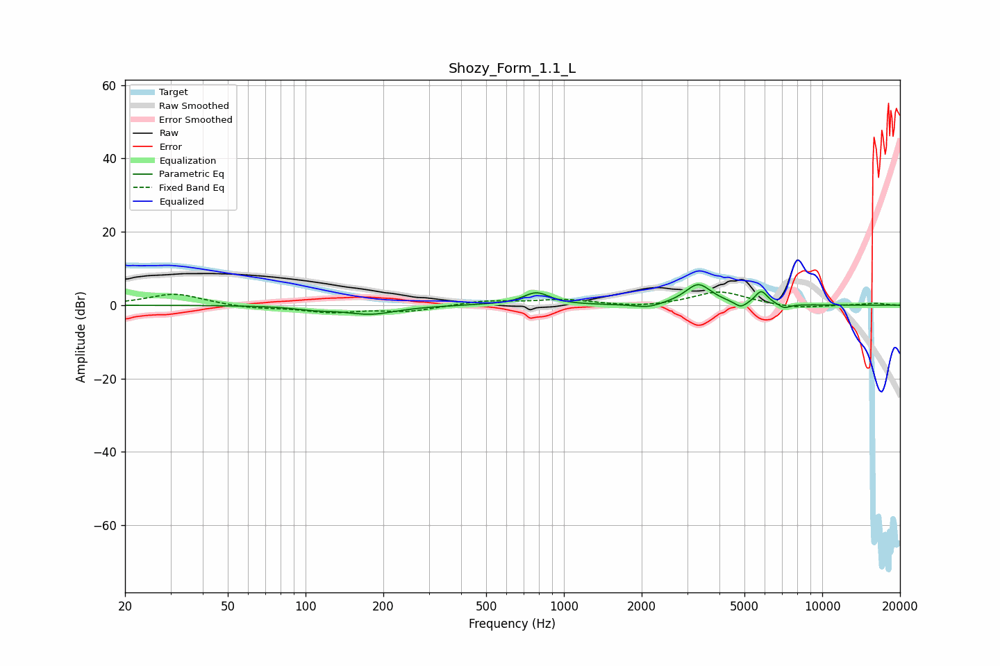

# Shozy_Form_1.1_L
See [usage instructions](https://github.com/jaakkopasanen/AutoEq#usage) for more options and info.

### Parametric EQs
Apply preamp of -5.7 dB when using parametric equalizer.

|   # | Type    |   Fc (Hz) |    Q |   Gain (dB) |
|-----|---------|-----------|------|-------------|
|   1 | Peaking |       107 | 1.83 |        -0.8 |
|   2 | Peaking |       179 | 1.42 |        -2.3 |
|   3 | Peaking |       498 | 1.65 |         0.2 |
|   4 | Peaking |       783 | 2.76 |         3.4 |
|   5 | Peaking |      2117 | 2.75 |        -1.1 |
|   6 | Peaking |      3313 | 2.72 |         5.7 |
|   7 | Peaking |      4840 | 5.99 |        -1.7 |
|   8 | Peaking |      5793 | 6    |         3   |
|   9 | Peaking |      5920 | 5    |         0.6 |
|  10 | Peaking |      7130 | 5.98 |        -1.2 |

### Fixed Band EQs
When using fixed band (also called graphic) equalizer, apply preamp of **-3.7 dB** (if available) and set gains manually with these parameters.

|   # | Type    |   Fc (Hz) |    Q |   Gain (dB) |
|-----|---------|-----------|------|-------------|
|   1 | Peaking |        31 | 1.41 |         3.2 |
|   2 | Peaking |        62 | 1.41 |        -0.8 |
|   3 | Peaking |       125 | 1.41 |        -1.8 |
|   4 | Peaking |       250 | 1.41 |        -1.6 |
|   5 | Peaking |       500 | 1.41 |         1.2 |
|   6 | Peaking |      1000 | 1.41 |         1.4 |
|   7 | Peaking |      2000 | 1.41 |        -0.7 |
|   8 | Peaking |      4000 | 1.41 |         3.8 |
|   9 | Peaking |      8000 | 1.41 |        -1   |
|  10 | Peaking |     16000 | 1.41 |         0.5 |

### Graphs

