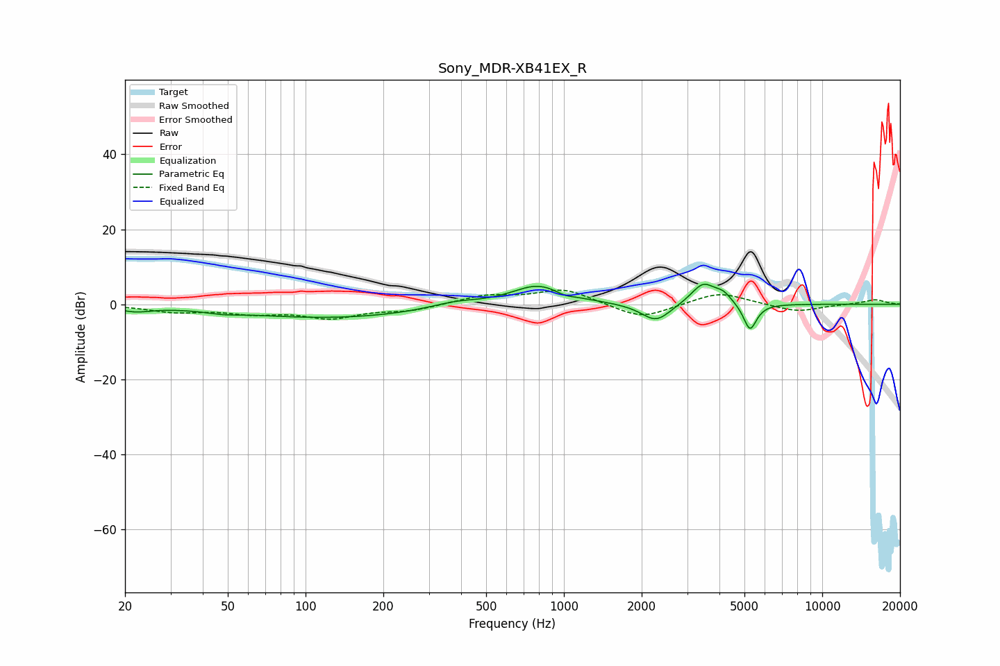

# Sony_MDR-XB41EX_R
See [usage instructions](https://github.com/jaakkopasanen/AutoEq#usage) for more options and info.

### Parametric EQs
Apply preamp of -5.4 dB when using parametric equalizer.

|   # | Type    |   Fc (Hz) |    Q |   Gain (dB) |
|-----|---------|-----------|------|-------------|
|   1 | Peaking |        22 | 2.26 |        -1.4 |
|   2 | Peaking |        48 | 2.3  |        -0.7 |
|   3 | Peaking |       126 | 0.39 |        -3.6 |
|   4 | Peaking |       377 | 1.49 |         1.5 |
|   5 | Peaking |       794 | 1.36 |         5.4 |
|   6 | Peaking |      1006 | 3.91 |        -0.9 |
|   7 | Peaking |      2274 | 2.46 |        -5   |
|   8 | Peaking |      3458 | 2.95 |         5.7 |
|   9 | Peaking |      4140 | 4.3  |         2.3 |
|  10 | Peaking |      5254 | 5.43 |        -7.4 |

### Fixed Band EQs
When using fixed band (also called graphic) equalizer, apply preamp of **-3.8 dB** (if available) and set gains manually with these parameters.

|   # | Type    |   Fc (Hz) |    Q |   Gain (dB) |
|-----|---------|-----------|------|-------------|
|   1 | Peaking |        31 | 1.41 |        -1.8 |
|   2 | Peaking |        62 | 1.41 |        -2   |
|   3 | Peaking |       125 | 1.41 |        -3.4 |
|   4 | Peaking |       250 | 1.41 |        -1.6 |
|   5 | Peaking |       500 | 1.41 |         2.2 |
|   6 | Peaking |      1000 | 1.41 |         4   |
|   7 | Peaking |      2000 | 1.41 |        -4.1 |
|   8 | Peaking |      4000 | 1.41 |         3.4 |
|   9 | Peaking |      8000 | 1.41 |        -2.1 |
|  10 | Peaking |     16000 | 1.41 |         1.3 |

### Graphs

