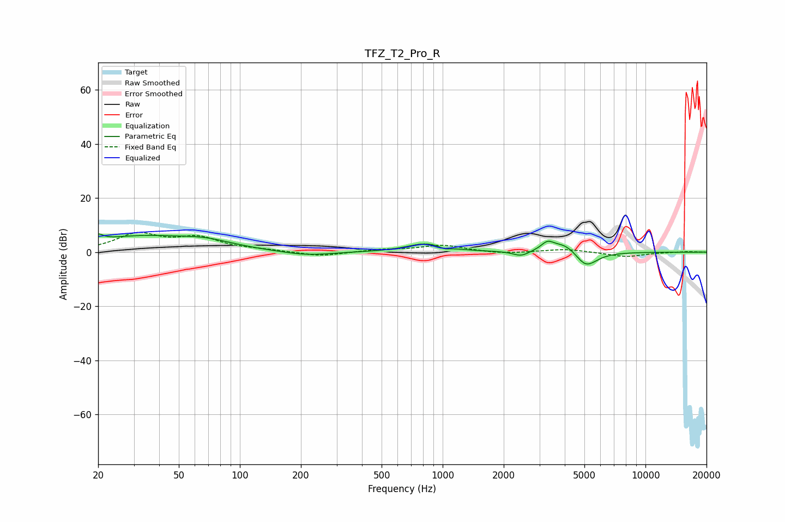

# TFZ_T2_Pro_R
See [usage instructions](https://github.com/jaakkopasanen/AutoEq#usage) for more options and info.

### Parametric EQs
Apply preamp of -6.8 dB when using parametric equalizer.

|   # | Type    |   Fc (Hz) |    Q |   Gain (dB) |
|-----|---------|-----------|------|-------------|
|   1 | Peaking |        20 | 6    |         2.3 |
|   2 | Peaking |        32 | 0.55 |         5.4 |
|   3 | Peaking |        68 | 1.05 |         2.5 |
|   4 | Peaking |       213 | 1.14 |        -1.5 |
|   5 | Peaking |       827 | 1.52 |         3.2 |
|   6 | Peaking |      1021 | 5.33 |        -0.9 |
|   7 | Peaking |      2437 | 3.54 |        -2   |
|   8 | Peaking |      3285 | 4.67 |         2.8 |
|   9 | Peaking |      4036 | 1.93 |         4.3 |
|  10 | Peaking |      5069 | 2.46 |        -6.6 |

### Fixed Band EQs
When using fixed band (also called graphic) equalizer, apply preamp of **-7.4 dB** (if available) and set gains manually with these parameters.

|   # | Type    |   Fc (Hz) |    Q |   Gain (dB) |
|-----|---------|-----------|------|-------------|
|   1 | Peaking |        31 | 1.41 |         6.4 |
|   2 | Peaking |        62 | 1.41 |         4.8 |
|   3 | Peaking |       125 | 1.41 |         0.6 |
|   4 | Peaking |       250 | 1.41 |        -1.6 |
|   5 | Peaking |       500 | 1.41 |         0.8 |
|   6 | Peaking |      1000 | 1.41 |         2.5 |
|   7 | Peaking |      2000 | 1.41 |        -0.7 |
|   8 | Peaking |      4000 | 1.41 |         1.2 |
|   9 | Peaking |      8000 | 1.41 |        -1.7 |
|  10 | Peaking |     16000 | 1.41 |         0.2 |

### Graphs

