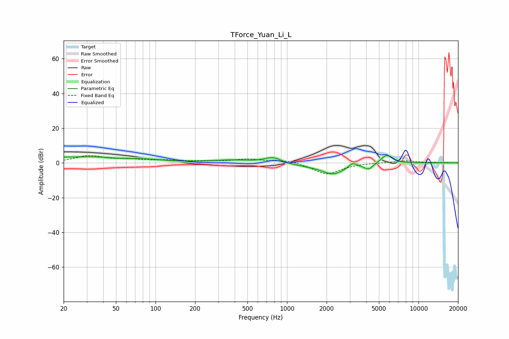

# TForce_Yuan_Li_L
See [usage instructions](https://github.com/jaakkopasanen/AutoEq#usage) for more options and info.

### Parametric EQs
Apply preamp of -4.4 dB when using parametric equalizer.

|   # | Type    |   Fc (Hz) |    Q |   Gain (dB) |
|-----|---------|-----------|------|-------------|
|   1 | Peaking |        20 | 3.02 |         1.2 |
|   2 | Peaking |        31 | 0.81 |         3.2 |
|   3 | Peaking |        83 | 0.98 |         1.6 |
|   4 | Peaking |       383 | 0.98 |         1.5 |
|   5 | Peaking |       780 | 2.27 |         3.3 |
|   6 | Peaking |      1298 | 1.22 |        -1   |
|   7 | Peaking |      2238 | 1.54 |        -6.3 |
|   8 | Peaking |      3145 | 4.99 |         2.6 |
|   9 | Peaking |      4171 | 4.27 |        -3.3 |
|  10 | Peaking |      5709 | 3.32 |         5.1 |

### Fixed Band EQs
When using fixed band (also called graphic) equalizer, apply preamp of **-4.3 dB** (if available) and set gains manually with these parameters.

|   # | Type    |   Fc (Hz) |    Q |   Gain (dB) |
|-----|---------|-----------|------|-------------|
|   1 | Peaking |        31 | 1.41 |         3.9 |
|   2 | Peaking |        62 | 1.41 |         1.6 |
|   3 | Peaking |       125 | 1.41 |         1.2 |
|   4 | Peaking |       250 | 1.41 |         0.7 |
|   5 | Peaking |       500 | 1.41 |         2   |
|   6 | Peaking |      1000 | 1.41 |         1.7 |
|   7 | Peaking |      2000 | 1.41 |        -6.7 |
|   8 | Peaking |      4000 | 1.41 |         0.2 |
|   9 | Peaking |      8000 | 1.41 |         1.2 |
|  10 | Peaking |     16000 | 1.41 |         0.1 |

### Graphs

