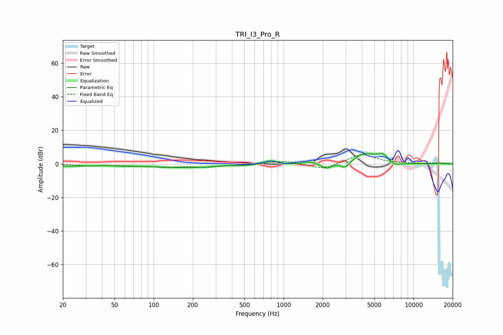

# TRI_I3_Pro_R
See [usage instructions](https://github.com/jaakkopasanen/AutoEq#usage) for more options and info.

### Parametric EQs
Apply preamp of -6.3 dB when using parametric equalizer.

|   # | Type    |   Fc (Hz) |    Q |   Gain (dB) |
|-----|---------|-----------|------|-------------|
|   1 | Peaking |        20 | 0.68 |        -1.3 |
|   2 | Peaking |       267 | 0.31 |        -2.6 |
|   3 | Peaking |       357 | 1.29 |         1.3 |
|   4 | Peaking |       781 | 2.18 |         3   |
|   5 | Peaking |      1585 | 3.15 |         1.6 |
|   6 | Peaking |      2143 | 3.69 |        -3   |
|   7 | Peaking |      2969 | 4.04 |        -3.9 |
|   8 | Peaking |      4141 | 1.69 |         5.7 |
|   9 | Peaking |      5883 | 2.54 |         6   |
|  10 | Peaking |      6886 | 2.24 |        -3.6 |

### Fixed Band EQs
When using fixed band (also called graphic) equalizer, apply preamp of **-5.5 dB** (if available) and set gains manually with these parameters.

|   # | Type    |   Fc (Hz) |    Q |   Gain (dB) |
|-----|---------|-----------|------|-------------|
|   1 | Peaking |        31 | 1.41 |        -1   |
|   2 | Peaking |        62 | 1.41 |        -1   |
|   3 | Peaking |       125 | 1.41 |        -1.6 |
|   4 | Peaking |       250 | 1.41 |        -1.7 |
|   5 | Peaking |       500 | 1.41 |        -0.6 |
|   6 | Peaking |      1000 | 1.41 |         2   |
|   7 | Peaking |      2000 | 1.41 |        -3.5 |
|   8 | Peaking |      4000 | 1.41 |         5.9 |
|   9 | Peaking |      8000 | 1.41 |         0.1 |
|  10 | Peaking |     16000 | 1.41 |         0.7 |

### Graphs

