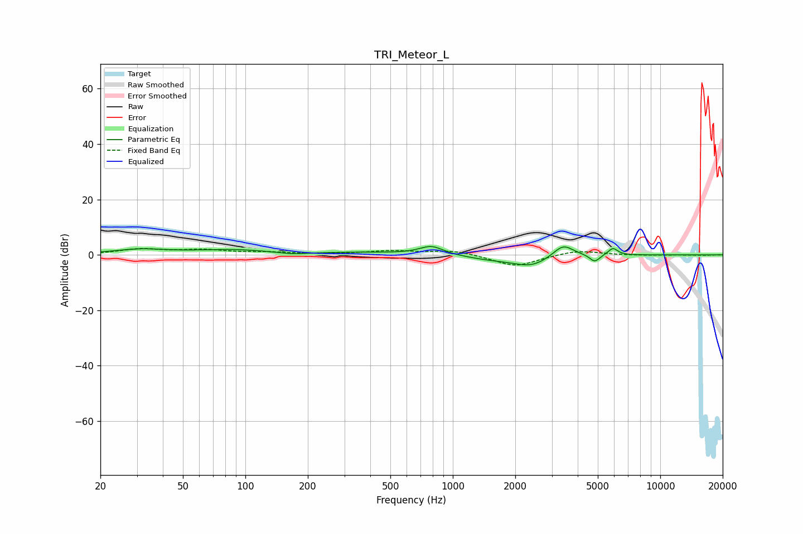

# TRI_Meteor_L
See [usage instructions](https://github.com/jaakkopasanen/AutoEq#usage) for more options and info.

### Parametric EQs
Apply preamp of -3.1 dB when using parametric equalizer.

|   # | Type    |   Fc (Hz) |    Q |   Gain (dB) |
|-----|---------|-----------|------|-------------|
|   1 | Peaking |        31 | 1.1  |         1.8 |
|   2 | Peaking |        87 | 0.77 |         1.7 |
|   3 | Peaking |       168 | 2.05 |        -0.7 |
|   4 | Peaking |       370 | 0.67 |         0.8 |
|   5 | Peaking |       788 | 2.45 |         3.2 |
|   6 | Peaking |      1543 | 1.1  |        -1.4 |
|   7 | Peaking |      2391 | 1.62 |        -3.7 |
|   8 | Peaking |      3404 | 2.87 |         4.7 |
|   9 | Peaking |      4829 | 5.89 |        -2.7 |
|  10 | Peaking |      5912 | 6    |         2.6 |

### Fixed Band EQs
When using fixed band (also called graphic) equalizer, apply preamp of **-2.4 dB** (if available) and set gains manually with these parameters.

|   # | Type    |   Fc (Hz) |    Q |   Gain (dB) |
|-----|---------|-----------|------|-------------|
|   1 | Peaking |        31 | 1.41 |         1.9 |
|   2 | Peaking |        62 | 1.41 |         1.6 |
|   3 | Peaking |       125 | 1.41 |         0.8 |
|   4 | Peaking |       250 | 1.41 |         0.2 |
|   5 | Peaking |       500 | 1.41 |         1.3 |
|   6 | Peaking |      1000 | 1.41 |         1.7 |
|   7 | Peaking |      2000 | 1.41 |        -4.3 |
|   8 | Peaking |      4000 | 1.41 |         1.8 |
|   9 | Peaking |      8000 | 1.41 |        -0.2 |
|  10 | Peaking |     16000 | 1.41 |        -0.2 |

### Graphs

