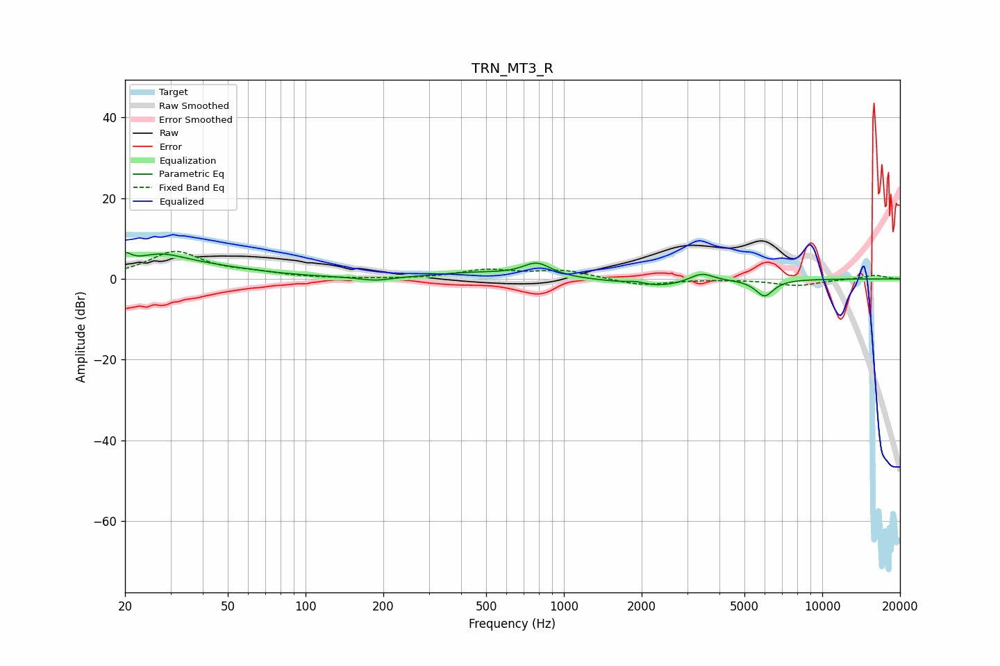

# TRN_MT3_R
See [usage instructions](https://github.com/jaakkopasanen/AutoEq#usage) for more options and info.

### Parametric EQs
Apply preamp of -6.6 dB when using parametric equalizer.

|   # | Type    |   Fc (Hz) |    Q |   Gain (dB) |
|-----|---------|-----------|------|-------------|
|   1 | Peaking |        20 | 5.92 |         2.8 |
|   2 | Peaking |        27 | 1.3  |         4.5 |
|   3 | Peaking |        43 | 0.71 |         2.1 |
|   4 | Peaking |       187 | 2.3  |        -0.9 |
|   5 | Peaking |       448 | 0.9  |         1.4 |
|   6 | Peaking |       786 | 2.58 |         3.4 |
|   7 | Peaking |      1908 | 3.82 |         0.8 |
|   8 | Peaking |      2257 | 1.16 |        -2.1 |
|   9 | Peaking |      3410 | 3.09 |         2.2 |
|  10 | Peaking |      5980 | 3.93 |        -4.1 |

### Fixed Band EQs
When using fixed band (also called graphic) equalizer, apply preamp of **-6.9 dB** (if available) and set gains manually with these parameters.

|   # | Type    |   Fc (Hz) |    Q |   Gain (dB) |
|-----|---------|-----------|------|-------------|
|   1 | Peaking |        31 | 1.41 |         6.6 |
|   2 | Peaking |        62 | 1.41 |         1.1 |
|   3 | Peaking |       125 | 1.41 |        -0   |
|   4 | Peaking |       250 | 1.41 |        -0.1 |
|   5 | Peaking |       500 | 1.41 |         2.1 |
|   6 | Peaking |      1000 | 1.41 |         2   |
|   7 | Peaking |      2000 | 1.41 |        -1.7 |
|   8 | Peaking |      4000 | 1.41 |         0   |
|   9 | Peaking |      8000 | 1.41 |        -1.6 |
|  10 | Peaking |     16000 | 1.41 |         0.9 |

### Graphs

