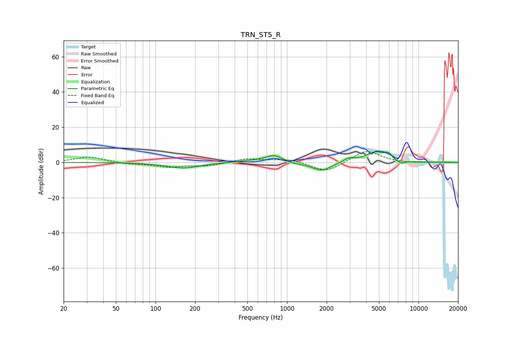

# TRN_ST5_R
See [usage instructions](https://github.com/jaakkopasanen/AutoEq#usage) for more options and info.

### Parametric EQs
Apply preamp of -6.2 dB when using parametric equalizer.

|   # | Type    |   Fc (Hz) |    Q |   Gain (dB) |
|-----|---------|-----------|------|-------------|
|   1 | Peaking |       162 | 1.13 |        -3.2 |
|   2 | Peaking |       507 | 1.24 |         0.8 |
|   3 | Peaking |       805 | 2.01 |         4.1 |
|   4 | Peaking |       820 | 1.92 |         0.6 |
|   5 | Peaking |      1047 | 1.41 |        -1.3 |
|   6 | Peaking |      1836 | 1.96 |        -4.8 |
|   7 | Peaking |      2956 | 3.37 |         2.3 |
|   8 | Peaking |      4699 | 1.95 |         5.7 |
|   9 | Peaking |      5877 | 5.01 |         3   |
|  10 | Peaking |      7361 | 4.77 |        -1.7 |

### Fixed Band EQs
When using fixed band (also called graphic) equalizer, apply preamp of **-6.3 dB** (if available) and set gains manually with these parameters.

|   # | Type    |   Fc (Hz) |    Q |   Gain (dB) |
|-----|---------|-----------|------|-------------|
|   1 | Peaking |        31 | 1.41 |         3.2 |
|   2 | Peaking |        62 | 1.41 |        -0.9 |
|   3 | Peaking |       125 | 1.41 |        -2.4 |
|   4 | Peaking |       250 | 1.41 |        -1.9 |
|   5 | Peaking |       500 | 1.41 |         2.2 |
|   6 | Peaking |      1000 | 1.41 |         2   |
|   7 | Peaking |      2000 | 1.41 |        -5.8 |
|   8 | Peaking |      4000 | 1.41 |         7.2 |
|   9 | Peaking |      8000 | 1.41 |        -0.5 |
|  10 | Peaking |     16000 | 1.41 |         0.1 |

### Graphs

