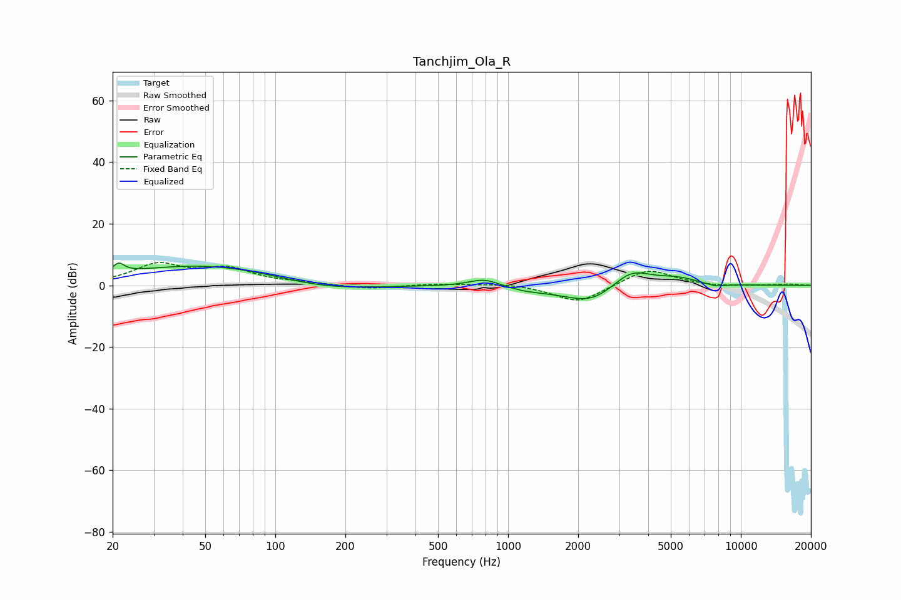

# Tanchjim_Ola_R
See [usage instructions](https://github.com/jaakkopasanen/AutoEq#usage) for more options and info.

### Parametric EQs
Apply preamp of -7.3 dB when using parametric equalizer.

|   # | Type    |   Fc (Hz) |    Q |   Gain (dB) |
|-----|---------|-----------|------|-------------|
|   1 | Peaking |        21 | 5.97 |         3.1 |
|   2 | Peaking |        52 | 0.38 |         6.9 |
|   3 | Peaking |       156 | 0.64 |        -3.2 |
|   4 | Peaking |       790 | 2.13 |         2.6 |
|   5 | Peaking |      1193 | 1.64 |        -1   |
|   6 | Peaking |      1973 | 0.92 |        -2.1 |
|   7 | Peaking |      2304 | 1.47 |        -4.1 |
|   8 | Peaking |      3393 | 1.69 |         5.8 |
|   9 | Peaking |      5324 | 1.52 |         2.2 |
|  10 | Peaking |      7779 | 3.02 |        -1   |

### Fixed Band EQs
When using fixed band (also called graphic) equalizer, apply preamp of **-7.5 dB** (if available) and set gains manually with these parameters.

|   # | Type    |   Fc (Hz) |    Q |   Gain (dB) |
|-----|---------|-----------|------|-------------|
|   1 | Peaking |        31 | 1.41 |         6.5 |
|   2 | Peaking |        62 | 1.41 |         4.9 |
|   3 | Peaking |       125 | 1.41 |         0.6 |
|   4 | Peaking |       250 | 1.41 |        -1.2 |
|   5 | Peaking |       500 | 1.41 |         0.5 |
|   6 | Peaking |      1000 | 1.41 |         0.7 |
|   7 | Peaking |      2000 | 1.41 |        -5.8 |
|   8 | Peaking |      4000 | 1.41 |         5.6 |
|   9 | Peaking |      8000 | 1.41 |        -0.4 |
|  10 | Peaking |     16000 | 1.41 |         0.4 |

### Graphs

