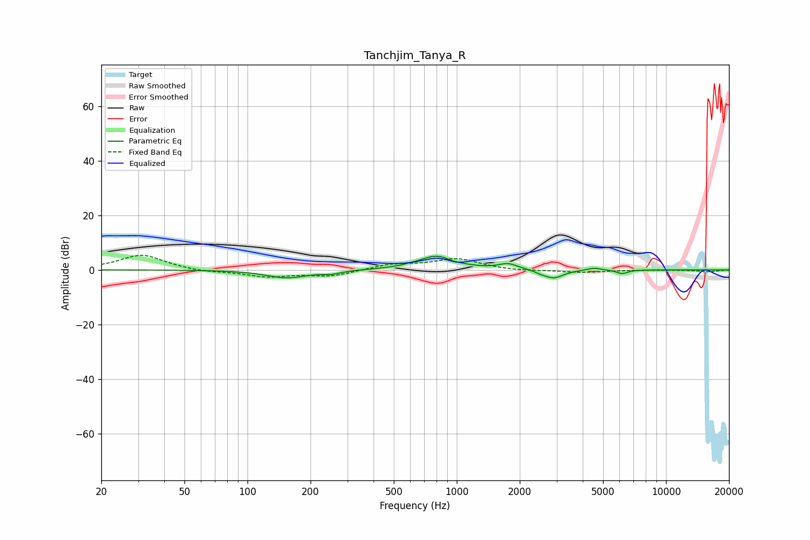

# Tanchjim_Tanya_R
See [usage instructions](https://github.com/jaakkopasanen/AutoEq#usage) for more options and info.

### Parametric EQs
Apply preamp of -5.1 dB when using parametric equalizer.

|   # | Type    |   Fc (Hz) |    Q |   Gain (dB) |
|-----|---------|-----------|------|-------------|
|   1 | Peaking |       154 | 1.44 |        -2.9 |
|   2 | Peaking |       252 | 3.27 |        -1   |
|   3 | Peaking |       611 | 2.04 |         0.3 |
|   4 | Peaking |       806 | 1.69 |         5   |
|   5 | Peaking |       960 | 5.13 |        -0.5 |
|   6 | Peaking |      1760 | 3.18 |         2.1 |
|   7 | Peaking |      2523 | 5.41 |        -0.6 |
|   8 | Peaking |      2906 | 3.09 |        -3.1 |
|   9 | Peaking |      4530 | 4.34 |         0.9 |
|  10 | Peaking |      6175 | 5.4  |        -1.4 |

### Fixed Band EQs
When using fixed band (also called graphic) equalizer, apply preamp of **-5.4 dB** (if available) and set gains manually with these parameters.

|   # | Type    |   Fc (Hz) |    Q |   Gain (dB) |
|-----|---------|-----------|------|-------------|
|   1 | Peaking |        31 | 1.41 |         5.6 |
|   2 | Peaking |        62 | 1.41 |        -0.9 |
|   3 | Peaking |       125 | 1.41 |        -2.4 |
|   4 | Peaking |       250 | 1.41 |        -2.2 |
|   5 | Peaking |       500 | 1.41 |         2   |
|   6 | Peaking |      1000 | 1.41 |         3.9 |
|   7 | Peaking |      2000 | 1.41 |        -0.5 |
|   8 | Peaking |      4000 | 1.41 |        -0.9 |
|   9 | Peaking |      8000 | 1.41 |        -0   |
|  10 | Peaking |     16000 | 1.41 |        -0.7 |

### Graphs

