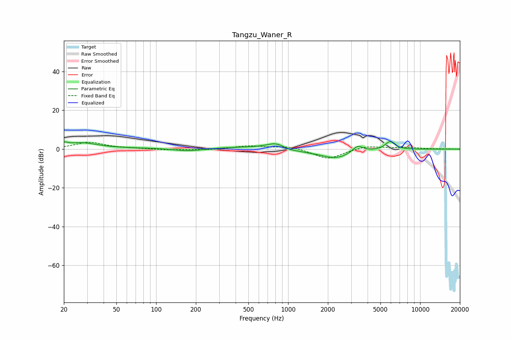

# Tangzu_Waner_R
See [usage instructions](https://github.com/jaakkopasanen/AutoEq#usage) for more options and info.

### Parametric EQs
Apply preamp of -3.9 dB when using parametric equalizer.

|   # | Type    |   Fc (Hz) |    Q |   Gain (dB) |
|-----|---------|-----------|------|-------------|
|   1 | Peaking |        20 | 5.93 |         1.4 |
|   2 | Peaking |        27 | 1.12 |         3.1 |
|   3 | Peaking |       176 | 1.09 |        -1.9 |
|   4 | Peaking |       332 | 0.24 |         1.2 |
|   5 | Peaking |       820 | 1.96 |         3.3 |
|   6 | Peaking |      1007 | 1.95 |        -1.5 |
|   7 | Peaking |      1423 | 2.35 |        -0.3 |
|   8 | Peaking |      2292 | 1.09 |        -5.1 |
|   9 | Peaking |      3361 | 3.38 |         3.8 |
|  10 | Peaking |      5909 | 3.75 |         4.3 |

### Fixed Band EQs
When using fixed band (also called graphic) equalizer, apply preamp of **-3.6 dB** (if available) and set gains manually with these parameters.

|   # | Type    |   Fc (Hz) |    Q |   Gain (dB) |
|-----|---------|-----------|------|-------------|
|   1 | Peaking |        31 | 1.41 |         3.5 |
|   2 | Peaking |        62 | 1.41 |         0.2 |
|   3 | Peaking |       125 | 1.41 |        -0.4 |
|   4 | Peaking |       250 | 1.41 |        -0.4 |
|   5 | Peaking |       500 | 1.41 |         1.6 |
|   6 | Peaking |      1000 | 1.41 |         1.6 |
|   7 | Peaking |      2000 | 1.41 |        -5.2 |
|   8 | Peaking |      4000 | 1.41 |         1.8 |
|   9 | Peaking |      8000 | 1.41 |         0.8 |
|  10 | Peaking |     16000 | 1.41 |         0.1 |

### Graphs

