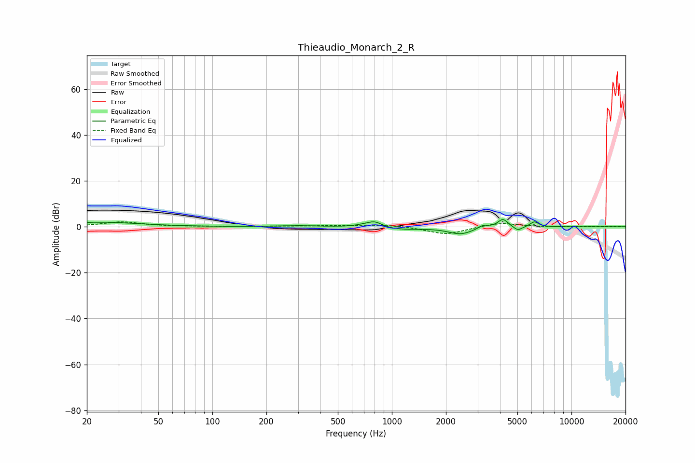

# Thieaudio_Monarch_2_R
See [usage instructions](https://github.com/jaakkopasanen/AutoEq#usage) for more options and info.

### Parametric EQs
Apply preamp of -3.2 dB when using parametric equalizer.

|   # | Type    |   Fc (Hz) |    Q |   Gain (dB) |
|-----|---------|-----------|------|-------------|
|   1 | Peaking |        24 | 0.66 |         2   |
|   2 | Peaking |       304 | 1.24 |         0.5 |
|   3 | Peaking |       701 | 2.65 |         0.8 |
|   4 | Peaking |       804 | 3.4  |         2.5 |
|   5 | Peaking |      1068 | 1.11 |        -1.2 |
|   6 | Peaking |      2415 | 2.06 |        -3   |
|   7 | Peaking |      3223 | 5.28 |         1.5 |
|   8 | Peaking |      4152 | 5.06 |         3.7 |
|   9 | Peaking |      5030 | 5.95 |        -1.9 |
|  10 | Peaking |      6219 | 5.87 |         2.3 |

### Fixed Band EQs
When using fixed band (also called graphic) equalizer, apply preamp of **-2.2 dB** (if available) and set gains manually with these parameters.

|   # | Type    |   Fc (Hz) |    Q |   Gain (dB) |
|-----|---------|-----------|------|-------------|
|   1 | Peaking |        31 | 1.41 |         2.1 |
|   2 | Peaking |        62 | 1.41 |         0.1 |
|   3 | Peaking |       125 | 1.41 |         0.2 |
|   4 | Peaking |       250 | 1.41 |         0.2 |
|   5 | Peaking |       500 | 1.41 |         0.5 |
|   6 | Peaking |      1000 | 1.41 |         0.8 |
|   7 | Peaking |      2000 | 1.41 |        -3.4 |
|   8 | Peaking |      4000 | 1.41 |         1.9 |
|   9 | Peaking |      8000 | 1.41 |        -0.1 |
|  10 | Peaking |     16000 | 1.41 |         0.2 |

### Graphs

