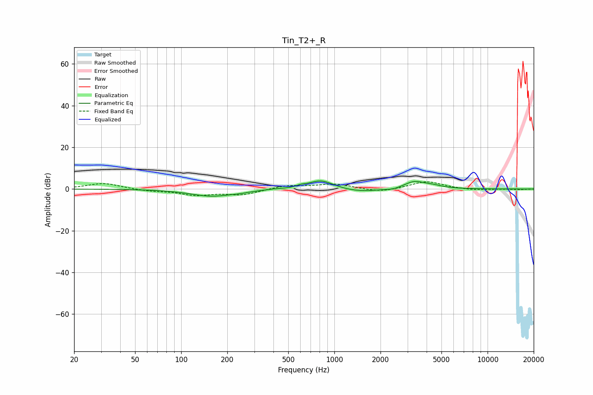

# Tin_T2+_R
See [usage instructions](https://github.com/jaakkopasanen/AutoEq#usage) for more options and info.

### Parametric EQs
Apply preamp of -4.0 dB when using parametric equalizer.

|   # | Type    |   Fc (Hz) |    Q |   Gain (dB) |
|-----|---------|-----------|------|-------------|
|   1 | Peaking |       158 | 1.02 |        -3.4 |
|   2 | Peaking |       244 | 2.29 |        -0.5 |
|   3 | Peaking |       402 | 2.82 |         0.2 |
|   4 | Peaking |       605 | 5.27 |         0.8 |
|   5 | Peaking |       806 | 1.8  |         4.1 |
|   6 | Peaking |       933 | 1.82 |         0.5 |
|   7 | Peaking |      1439 | 1.05 |        -1.6 |
|   8 | Peaking |      2449 | 2.76 |        -0.8 |
|   9 | Peaking |      3317 | 1.98 |         3.7 |
|  10 | Peaking |      4412 | 2.32 |         1   |

### Fixed Band EQs
When using fixed band (also called graphic) equalizer, apply preamp of **-3.5 dB** (if available) and set gains manually with these parameters.

|   # | Type    |   Fc (Hz) |    Q |   Gain (dB) |
|-----|---------|-----------|------|-------------|
|   1 | Peaking |        31 | 1.41 |         2.8 |
|   2 | Peaking |        62 | 1.41 |        -0.9 |
|   3 | Peaking |       125 | 1.41 |        -2.7 |
|   4 | Peaking |       250 | 1.41 |        -2.6 |
|   5 | Peaking |       500 | 1.41 |         1.8 |
|   6 | Peaking |      1000 | 1.41 |         2.4 |
|   7 | Peaking |      2000 | 1.41 |        -1.7 |
|   8 | Peaking |      4000 | 1.41 |         3.8 |
|   9 | Peaking |      8000 | 1.41 |        -0.7 |
|  10 | Peaking |     16000 | 1.41 |        -0.3 |

### Graphs

