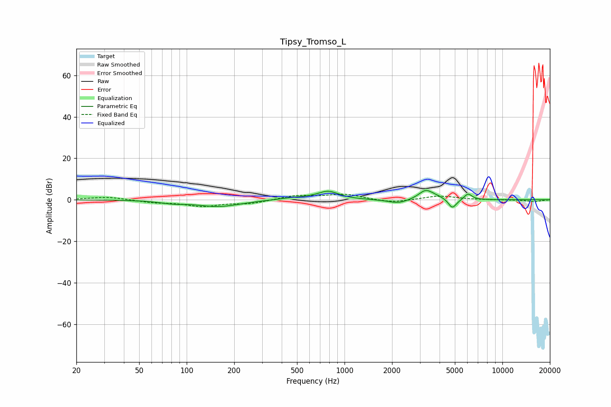

# Tipsy_Tromso_L
See [usage instructions](https://github.com/jaakkopasanen/AutoEq#usage) for more options and info.

### Parametric EQs
Apply preamp of -4.6 dB when using parametric equalizer.

|   # | Type    |   Fc (Hz) |    Q |   Gain (dB) |
|-----|---------|-----------|------|-------------|
|   1 | Peaking |        81 | 1.76 |        -1.2 |
|   2 | Peaking |       160 | 1.04 |        -3.2 |
|   3 | Peaking |       492 | 1.39 |         1   |
|   4 | Peaking |       788 | 2.13 |         3.9 |
|   5 | Peaking |      2196 | 2.15 |        -2   |
|   6 | Peaking |      3263 | 3.11 |         4.4 |
|   7 | Peaking |      3810 | 2.47 |         1.1 |
|   8 | Peaking |      4794 | 5.9  |        -3.7 |
|   9 | Peaking |      5001 | 4.44 |        -1.2 |
|  10 | Peaking |      6056 | 5.45 |         3   |

### Fixed Band EQs
When using fixed band (also called graphic) equalizer, apply preamp of **-2.8 dB** (if available) and set gains manually with these parameters.

|   # | Type    |   Fc (Hz) |    Q |   Gain (dB) |
|-----|---------|-----------|------|-------------|
|   1 | Peaking |        31 | 1.41 |         1.4 |
|   2 | Peaking |        62 | 1.41 |        -1.2 |
|   3 | Peaking |       125 | 1.41 |        -2.9 |
|   4 | Peaking |       250 | 1.41 |        -1.7 |
|   5 | Peaking |       500 | 1.41 |         2.1 |
|   6 | Peaking |      1000 | 1.41 |         2.6 |
|   7 | Peaking |      2000 | 1.41 |        -1.5 |
|   8 | Peaking |      4000 | 1.41 |         1.9 |
|   9 | Peaking |      8000 | 1.41 |        -0   |
|  10 | Peaking |     16000 | 1.41 |        -0.9 |

### Graphs

