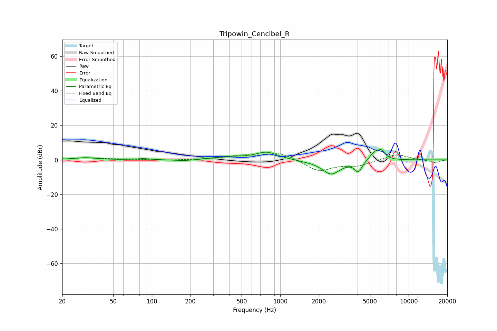

# Tripowin_Cencibel_R
See [usage instructions](https://github.com/jaakkopasanen/AutoEq#usage) for more options and info.

### Parametric EQs
Apply preamp of -6.0 dB when using parametric equalizer.

|   # | Type    |   Fc (Hz) |    Q |   Gain (dB) |
|-----|---------|-----------|------|-------------|
|   1 | Peaking |        30 | 1.61 |         1.2 |
|   2 | Peaking |        86 | 2.8  |         0.7 |
|   3 | Peaking |       181 | 1.58 |        -0.8 |
|   4 | Peaking |       390 | 1.11 |         1.6 |
|   5 | Peaking |       785 | 1.69 |         4.3 |
|   6 | Peaking |      1478 | 3.78 |        -0.2 |
|   7 | Peaking |      2490 | 1.9  |        -8.3 |
|   8 | Peaking |      4062 | 5.01 |        -6.3 |
|   9 | Peaking |      5500 | 3.36 |         5   |
|  10 | Peaking |      6176 | 5.27 |         3.7 |

### Fixed Band EQs
When using fixed band (also called graphic) equalizer, apply preamp of **-3.6 dB** (if available) and set gains manually with these parameters.

|   # | Type    |   Fc (Hz) |    Q |   Gain (dB) |
|-----|---------|-----------|------|-------------|
|   1 | Peaking |        31 | 1.41 |         1.1 |
|   2 | Peaking |        62 | 1.41 |         0.3 |
|   3 | Peaking |       125 | 1.41 |        -0.4 |
|   4 | Peaking |       250 | 1.41 |         0.2 |
|   5 | Peaking |       500 | 1.41 |         2.3 |
|   6 | Peaking |      1000 | 1.41 |         4.2 |
|   7 | Peaking |      2000 | 1.41 |        -6.5 |
|   8 | Peaking |      4000 | 1.41 |        -3.1 |
|   9 | Peaking |      8000 | 1.41 |         3.5 |
|  10 | Peaking |     16000 | 1.41 |        -1.6 |

### Graphs

