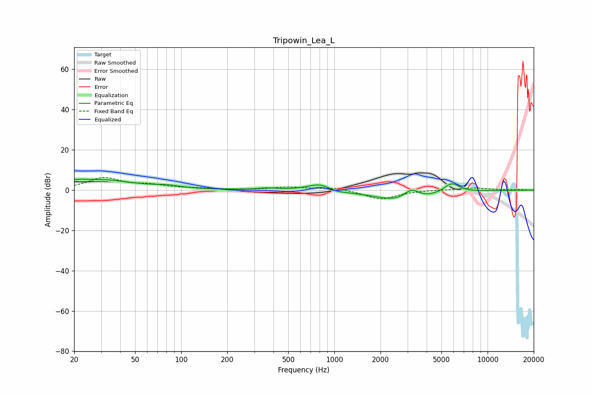

# Tripowin_Lea_L
See [usage instructions](https://github.com/jaakkopasanen/AutoEq#usage) for more options and info.

### Parametric EQs
Apply preamp of -5.5 dB when using parametric equalizer.

|   # | Type    |   Fc (Hz) |    Q |   Gain (dB) |
|-----|---------|-----------|------|-------------|
|   1 | Peaking |        25 | 0.56 |         5.7 |
|   2 | Peaking |        26 | 5.99 |         2.7 |
|   3 | Peaking |        26 | 5.24 |        -3.2 |
|   4 | Peaking |        82 | 1.7  |         1.1 |
|   5 | Peaking |       365 | 2.22 |         0.9 |
|   6 | Peaking |       807 | 1.81 |         3.8 |
|   7 | Peaking |      1015 | 2.25 |        -1.3 |
|   8 | Peaking |      2909 | 0.82 |        -6.8 |
|   9 | Peaking |      3181 | 2.59 |         6   |
|  10 | Peaking |      5827 | 2.59 |         5.1 |

### Fixed Band EQs
When using fixed band (also called graphic) equalizer, apply preamp of **-6.4 dB** (if available) and set gains manually with these parameters.

|   # | Type    |   Fc (Hz) |    Q |   Gain (dB) |
|-----|---------|-----------|------|-------------|
|   1 | Peaking |        31 | 1.41 |         5.9 |
|   2 | Peaking |        62 | 1.41 |         2.1 |
|   3 | Peaking |       125 | 1.41 |         0.7 |
|   4 | Peaking |       250 | 1.41 |         0.1 |
|   5 | Peaking |       500 | 1.41 |         1.4 |
|   6 | Peaking |      1000 | 1.41 |         1.3 |
|   7 | Peaking |      2000 | 1.41 |        -4.6 |
|   8 | Peaking |      4000 | 1.41 |         0.1 |
|   9 | Peaking |      8000 | 1.41 |         1.2 |
|  10 | Peaking |     16000 | 1.41 |         0.2 |

### Graphs

