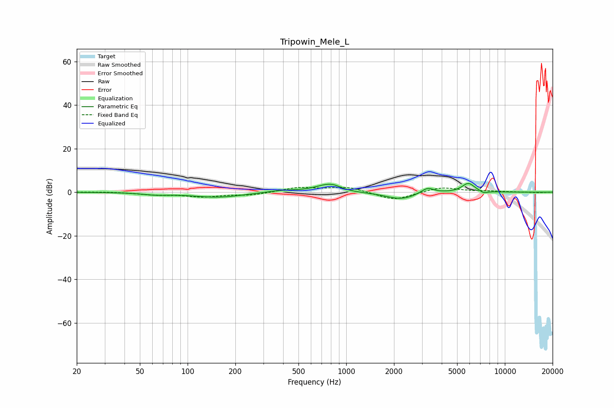

# Tripowin_Mele_L
See [usage instructions](https://github.com/jaakkopasanen/AutoEq#usage) for more options and info.

### Parametric EQs
Apply preamp of -4.1 dB when using parametric equalizer.

|   # | Type    |   Fc (Hz) |    Q |   Gain (dB) |
|-----|---------|-----------|------|-------------|
|   1 | Peaking |        63 | 1.81 |        -0.9 |
|   2 | Peaking |       155 | 0.85 |        -2.3 |
|   3 | Peaking |       391 | 1.33 |         1   |
|   4 | Peaking |       771 | 1.72 |         3.9 |
|   5 | Peaking |       840 | 4    |         0.6 |
|   6 | Peaking |       910 | 1.23 |        -0.6 |
|   7 | Peaking |      2222 | 1.46 |        -3.3 |
|   8 | Peaking |      3246 | 3.4  |         2.8 |
|   9 | Peaking |      5884 | 3.47 |         4.2 |
|  10 | Peaking |      7371 | 5.96 |        -1.1 |

### Fixed Band EQs
When using fixed band (also called graphic) equalizer, apply preamp of **-2.4 dB** (if available) and set gains manually with these parameters.

|   # | Type    |   Fc (Hz) |    Q |   Gain (dB) |
|-----|---------|-----------|------|-------------|
|   1 | Peaking |        31 | 1.41 |         0.2 |
|   2 | Peaking |        62 | 1.41 |        -1.1 |
|   3 | Peaking |       125 | 1.41 |        -1.9 |
|   4 | Peaking |       250 | 1.41 |        -1.3 |
|   5 | Peaking |       500 | 1.41 |         2.1 |
|   6 | Peaking |      1000 | 1.41 |         2.5 |
|   7 | Peaking |      2000 | 1.41 |        -3.8 |
|   8 | Peaking |      4000 | 1.41 |         2.4 |
|   9 | Peaking |      8000 | 1.41 |         0.4 |
|  10 | Peaking |     16000 | 1.41 |        -0.2 |

### Graphs

