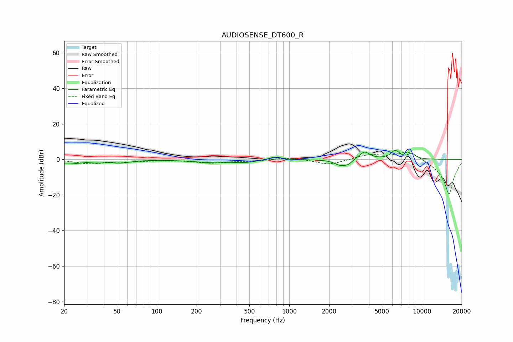

# AUDIOSENSE_DT600_R
See [usage instructions](https://github.com/jaakkopasanen/AutoEq#usage) for more options and info.

### Parametric EQs
Apply preamp of -5.1 dB when using parametric equalizer.

|   # | Type    |   Fc (Hz) |    Q |   Gain (dB) |
|-----|---------|-----------|------|-------------|
|   1 | Peaking |        21 | 1.22 |        -2.4 |
|   2 | Peaking |        52 | 1.77 |        -1.7 |
|   3 | Peaking |       280 | 0.92 |        -1.8 |
|   4 | Peaking |       482 | 2.2  |        -0.9 |
|   5 | Peaking |       785 | 3.63 |         1.8 |
|   6 | Peaking |      2460 | 2.91 |        -3.4 |
|   7 | Peaking |      2801 | 5.18 |        -1.6 |
|   8 | Peaking |      3683 | 3.58 |         4.5 |
|   9 | Peaking |      6309 | 4.07 |         4.7 |
|  10 | Peaking |      8374 | 4.63 |         2.9 |

### Fixed Band EQs
When using fixed band (also called graphic) equalizer, apply preamp of **-4.0 dB** (if available) and set gains manually with these parameters.

|   # | Type    |   Fc (Hz) |    Q |   Gain (dB) |
|-----|---------|-----------|------|-------------|
|   1 | Peaking |        31 | 1.41 |        -2.3 |
|   2 | Peaking |        62 | 1.41 |        -1   |
|   3 | Peaking |       125 | 1.41 |        -0.2 |
|   4 | Peaking |       250 | 1.41 |        -1.9 |
|   5 | Peaking |       500 | 1.41 |        -1   |
|   6 | Peaking |      1000 | 1.41 |         1.4 |
|   7 | Peaking |      2000 | 1.41 |        -3.2 |
|   8 | Peaking |      4000 | 1.41 |         2.7 |
|   9 | Peaking |      8000 | 1.41 |         5.3 |
|  10 | Peaking |     16000 | 1.41 |       -20   |

### Graphs

