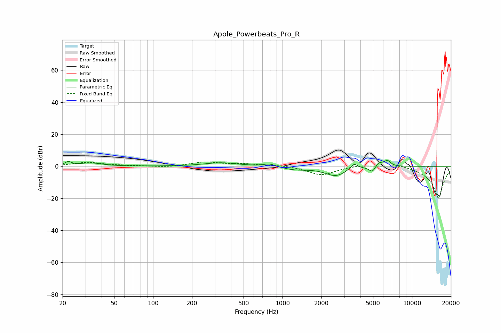

# Apple_Powerbeats_Pro_R
See [usage instructions](https://github.com/jaakkopasanen/AutoEq#usage) for more options and info.

### Parametric EQs
Apply preamp of -3.8 dB when using parametric equalizer.

|   # | Type    |   Fc (Hz) |    Q |   Gain (dB) |
|-----|---------|-----------|------|-------------|
|   1 | Peaking |        22 | 5.96 |         2.4 |
|   2 | Peaking |        33 | 1.71 |         2   |
|   3 | Peaking |       335 | 1.14 |         2.3 |
|   4 | Peaking |       794 | 3    |         1.9 |
|   5 | Peaking |      1247 | 1.44 |        -1.9 |
|   6 | Peaking |      2578 | 1.69 |        -5.8 |
|   7 | Peaking |      3571 | 4.91 |         3.8 |
|   8 | Peaking |      4953 | 5.44 |        -3.9 |
|   9 | Peaking |      5538 | 4.69 |         3.1 |
|  10 | Peaking |      6466 | 5.4  |         3.6 |

### Fixed Band EQs
When using fixed band (also called graphic) equalizer, apply preamp of **-2.8 dB** (if available) and set gains manually with these parameters.

|   # | Type    |   Fc (Hz) |    Q |   Gain (dB) |
|-----|---------|-----------|------|-------------|
|   1 | Peaking |        31 | 1.41 |         2.4 |
|   2 | Peaking |        62 | 1.41 |         0.3 |
|   3 | Peaking |       125 | 1.41 |        -0.7 |
|   4 | Peaking |       250 | 1.41 |         2.6 |
|   5 | Peaking |       500 | 1.41 |         1.3 |
|   6 | Peaking |      1000 | 1.41 |         0.8 |
|   7 | Peaking |      2000 | 1.41 |        -5.6 |
|   8 | Peaking |      4000 | 1.41 |         1.1 |
|   9 | Peaking |      8000 | 1.41 |         1.8 |
|  10 | Peaking |     16000 | 1.41 |       -20   |

### Graphs

