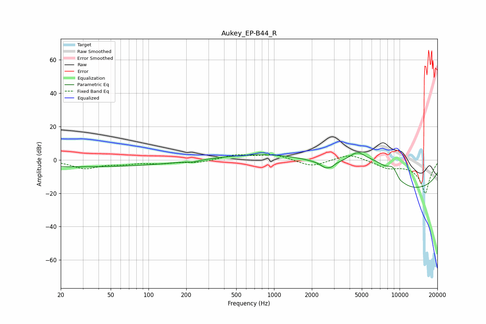

# Aukey_EP-B44_R
See [usage instructions](https://github.com/jaakkopasanen/AutoEq#usage) for more options and info.

### Parametric EQs
Apply preamp of -4.4 dB when using parametric equalizer.

|   # | Type    |   Fc (Hz) |    Q |   Gain (dB) |
|-----|---------|-----------|------|-------------|
|   1 | Peaking |        30 | 0.18 |        -4.1 |
|   2 | Peaking |       228 | 3.05 |        -0.9 |
|   3 | Peaking |      1356 | 0.35 |         7.6 |
|   4 | Peaking |      2574 | 3.54 |        -3.4 |
|   5 | Peaking |      2870 | 5.96 |        -1.3 |
|   6 | Peaking |      4629 | 1.31 |        13.3 |
|   7 | Peaking |      6574 | 1.36 |         7.2 |
|   8 | Peaking |      8817 | 2.42 |         8.2 |
|   9 | Peaking |     10000 | 0.18 |       -20   |
|  10 | Peaking |     10000 | 5.39 |        -1.2 |

### Fixed Band EQs
When using fixed band (also called graphic) equalizer, apply preamp of **-3.2 dB** (if available) and set gains manually with these parameters.

|   # | Type    |   Fc (Hz) |    Q |   Gain (dB) |
|-----|---------|-----------|------|-------------|
|   1 | Peaking |        31 | 1.41 |        -4.9 |
|   2 | Peaking |        62 | 1.41 |        -1.8 |
|   3 | Peaking |       125 | 1.41 |        -1.7 |
|   4 | Peaking |       250 | 1.41 |        -1.5 |
|   5 | Peaking |       500 | 1.41 |         3   |
|   6 | Peaking |      1000 | 1.41 |         3.2 |
|   7 | Peaking |      2000 | 1.41 |        -4.2 |
|   8 | Peaking |      4000 | 1.41 |         4   |
|   9 | Peaking |      8000 | 1.41 |        -3.9 |
|  10 | Peaking |     16000 | 1.41 |       -20   |

### Graphs

