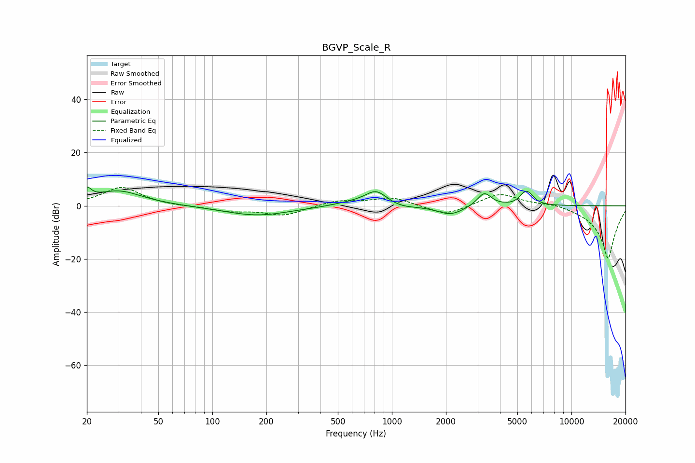

# BGVP_Scale_R
See [usage instructions](https://github.com/jaakkopasanen/AutoEq#usage) for more options and info.

### Parametric EQs
Apply preamp of -7.2 dB when using parametric equalizer.

|   # | Type    |   Fc (Hz) |    Q |   Gain (dB) |
|-----|---------|-----------|------|-------------|
|   1 | Peaking |        20 | 6    |         4   |
|   2 | Peaking |        30 | 1.05 |         5.6 |
|   3 | Peaking |       177 | 0.77 |        -3.7 |
|   4 | Peaking |       579 | 1.42 |         1   |
|   5 | Peaking |       817 | 2.2  |         5.8 |
|   6 | Peaking |      1110 | 1.78 |        -1.2 |
|   7 | Peaking |      2123 | 1.91 |        -3.5 |
|   8 | Peaking |      3269 | 3.62 |         5.2 |
|   9 | Peaking |      5401 | 5.34 |         2.3 |
|  10 | Peaking |      5779 | 4.39 |         3.7 |

### Fixed Band EQs
When using fixed band (also called graphic) equalizer, apply preamp of **-7.0 dB** (if available) and set gains manually with these parameters.

|   # | Type    |   Fc (Hz) |    Q |   Gain (dB) |
|-----|---------|-----------|------|-------------|
|   1 | Peaking |        31 | 1.41 |         7   |
|   2 | Peaking |        62 | 1.41 |        -0.3 |
|   3 | Peaking |       125 | 1.41 |        -1.9 |
|   4 | Peaking |       250 | 1.41 |        -3.6 |
|   5 | Peaking |       500 | 1.41 |         2   |
|   6 | Peaking |      1000 | 1.41 |         3.2 |
|   7 | Peaking |      2000 | 1.41 |        -3.8 |
|   8 | Peaking |      4000 | 1.41 |         4.9 |
|   9 | Peaking |      8000 | 1.41 |         1.3 |
|  10 | Peaking |     16000 | 1.41 |       -20   |

### Graphs

