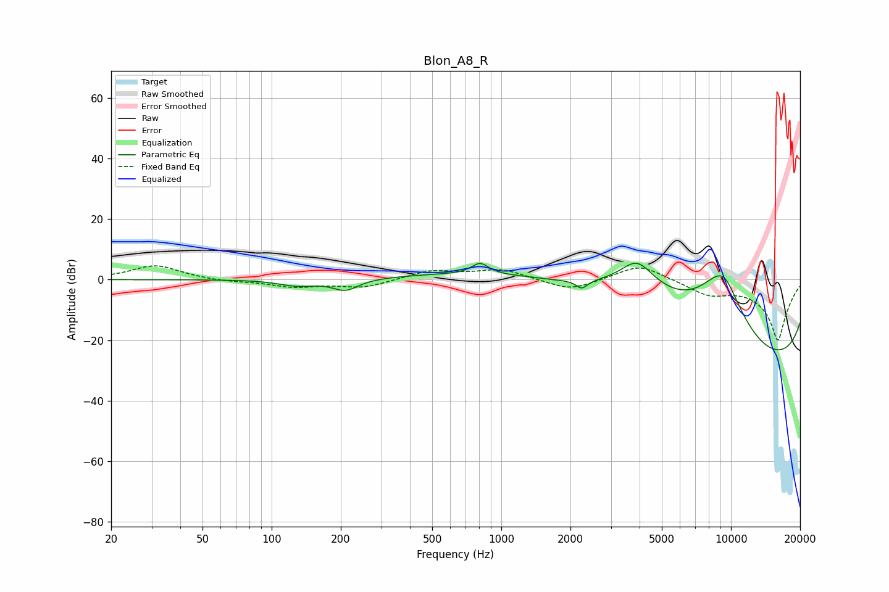

# Blon_A8_R
See [usage instructions](https://github.com/jaakkopasanen/AutoEq#usage) for more options and info.

### Parametric EQs
Apply preamp of -5.5 dB when using parametric equalizer.

|   # | Type    |   Fc (Hz) |    Q |   Gain (dB) |
|-----|---------|-----------|------|-------------|
|   1 | Peaking |       129 | 1.77 |        -2   |
|   2 | Peaking |       210 | 2.5  |        -3.7 |
|   3 | Peaking |       809 | 3.94 |         3.7 |
|   4 | Peaking |      1530 | 0.36 |         8.5 |
|   5 | Peaking |      2242 | 5.95 |        -2.7 |
|   6 | Peaking |      3900 | 0.97 |        20   |
|   7 | Peaking |      8661 | 0.67 |        17.7 |
|   8 | Peaking |      9352 | 1.11 |        17.6 |
|   9 | Peaking |     10000 | 0.18 |       -20   |
|  10 | Peaking |     10000 | 0.18 |       -20   |

### Fixed Band EQs
When using fixed band (also called graphic) equalizer, apply preamp of **-4.6 dB** (if available) and set gains manually with these parameters.

|   # | Type    |   Fc (Hz) |    Q |   Gain (dB) |
|-----|---------|-----------|------|-------------|
|   1 | Peaking |        31 | 1.41 |         4.7 |
|   2 | Peaking |        62 | 1.41 |        -0.7 |
|   3 | Peaking |       125 | 1.41 |        -2.3 |
|   4 | Peaking |       250 | 1.41 |        -2.6 |
|   5 | Peaking |       500 | 1.41 |         3   |
|   6 | Peaking |      1000 | 1.41 |         3.3 |
|   7 | Peaking |      2000 | 1.41 |        -3.9 |
|   8 | Peaking |      4000 | 1.41 |         5.3 |
|   9 | Peaking |      8000 | 1.41 |        -4.2 |
|  10 | Peaking |     16000 | 1.41 |       -20   |

### Graphs

