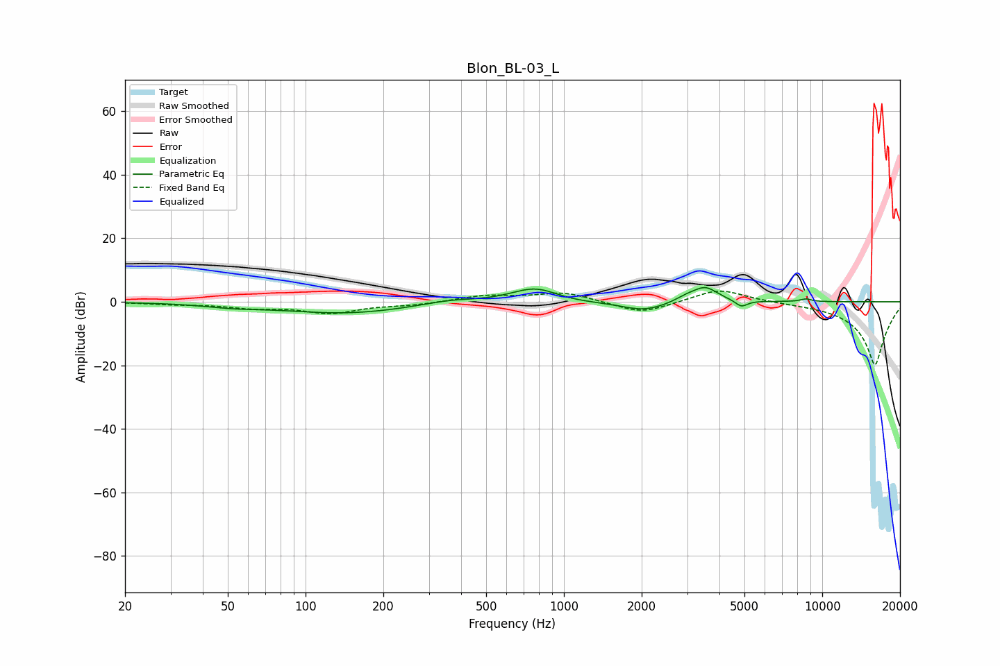

# Blon_BL-03_L
See [usage instructions](https://github.com/jaakkopasanen/AutoEq#usage) for more options and info.

### Parametric EQs
Apply preamp of -4.5 dB when using parametric equalizer.

|   # | Type    |   Fc (Hz) |    Q |   Gain (dB) |
|-----|---------|-----------|------|-------------|
|   1 | Peaking |        52 | 1.32 |        -0.9 |
|   2 | Peaking |       142 | 0.57 |        -3.6 |
|   3 | Peaking |       359 | 1.37 |         1.3 |
|   4 | Peaking |       772 | 1.52 |         4.6 |
|   5 | Peaking |      1089 | 1.73 |        -0.5 |
|   6 | Peaking |      2041 | 1.55 |        -3   |
|   7 | Peaking |      2983 | 3.06 |         1.5 |
|   8 | Peaking |      3531 | 2.88 |         4.5 |
|   9 | Peaking |      4865 | 6    |        -2.1 |
|  10 | Peaking |      8651 | 6    |         0.9 |

### Fixed Band EQs
When using fixed band (also called graphic) equalizer, apply preamp of **-3.4 dB** (if available) and set gains manually with these parameters.

|   # | Type    |   Fc (Hz) |    Q |   Gain (dB) |
|-----|---------|-----------|------|-------------|
|   1 | Peaking |        31 | 1.41 |        -0.6 |
|   2 | Peaking |        62 | 1.41 |        -1.6 |
|   3 | Peaking |       125 | 1.41 |        -3.4 |
|   4 | Peaking |       250 | 1.41 |        -0.9 |
|   5 | Peaking |       500 | 1.41 |         1.9 |
|   6 | Peaking |      1000 | 1.41 |         3   |
|   7 | Peaking |      2000 | 1.41 |        -3.9 |
|   8 | Peaking |      4000 | 1.41 |         4.3 |
|   9 | Peaking |      8000 | 1.41 |        -0.1 |
|  10 | Peaking |     16000 | 1.41 |       -20   |

### Graphs

