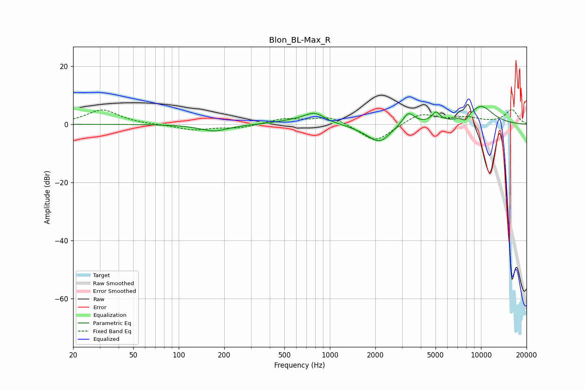

# Blon_BL-Max_R
See [usage instructions](https://github.com/jaakkopasanen/AutoEq#usage) for more options and info.

### Parametric EQs
Apply preamp of -6.2 dB when using parametric equalizer.

|   # | Type    |   Fc (Hz) |    Q |   Gain (dB) |
|-----|---------|-----------|------|-------------|
|   1 | Peaking |       171 | 1.47 |        -2.4 |
|   2 | Peaking |       552 | 1.19 |         0.8 |
|   3 | Peaking |       800 | 1.87 |         4.1 |
|   4 | Peaking |       929 | 2.02 |        -0.6 |
|   5 | Peaking |      1760 | 1.47 |        -1.1 |
|   6 | Peaking |      2140 | 1.94 |        -5.6 |
|   7 | Peaking |      3307 | 3.46 |         4.6 |
|   8 | Peaking |      5033 | 5.13 |         3.4 |
|   9 | Peaking |      7879 | 5.96 |        -1.9 |
|  10 | Peaking |     10000 | 1.42 |         6.2 |

### Fixed Band EQs
When using fixed band (also called graphic) equalizer, apply preamp of **-5.1 dB** (if available) and set gains manually with these parameters.

|   # | Type    |   Fc (Hz) |    Q |   Gain (dB) |
|-----|---------|-----------|------|-------------|
|   1 | Peaking |        31 | 1.41 |         5   |
|   2 | Peaking |        62 | 1.41 |        -0.1 |
|   3 | Peaking |       125 | 1.41 |        -1.9 |
|   4 | Peaking |       250 | 1.41 |        -1.3 |
|   5 | Peaking |       500 | 1.41 |         1.9 |
|   6 | Peaking |      1000 | 1.41 |         2.9 |
|   7 | Peaking |      2000 | 1.41 |        -6.4 |
|   8 | Peaking |      4000 | 1.41 |         3.9 |
|   9 | Peaking |      8000 | 1.41 |         2   |
|  10 | Peaking |     16000 | 1.41 |         4.9 |

### Graphs

