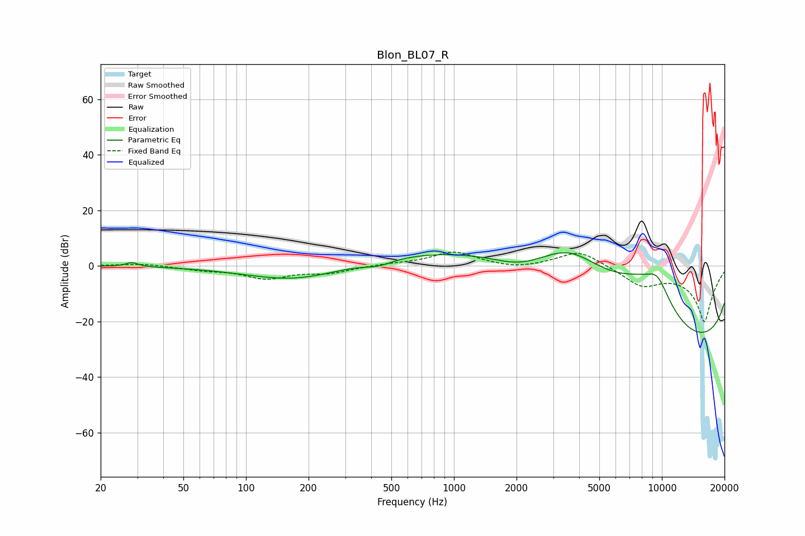

# Blon_BL07_R
See [usage instructions](https://github.com/jaakkopasanen/AutoEq#usage) for more options and info.

### Parametric EQs
Apply preamp of -4.8 dB when using parametric equalizer.

|   # | Type    |   Fc (Hz) |    Q |   Gain (dB) |
|-----|---------|-----------|------|-------------|
|   1 | Peaking |        28 | 4.87 |         1.5 |
|   2 | Peaking |       172 | 0.61 |        -5.6 |
|   3 | Peaking |       434 | 2.08 |        -1.9 |
|   4 | Peaking |      2052 | 1.15 |        -3.7 |
|   5 | Peaking |      2581 | 0.18 |        11.7 |
|   6 | Peaking |      3601 | 0.62 |        16.4 |
|   7 | Peaking |      7885 | 0.77 |        11.8 |
|   8 | Peaking |      9526 | 1.83 |        10.6 |
|   9 | Peaking |     10000 | 0.18 |       -19.8 |
|  10 | Peaking |     10000 | 0.18 |       -16.9 |

### Fixed Band EQs
When using fixed band (also called graphic) equalizer, apply preamp of **-5.0 dB** (if available) and set gains manually with these parameters.

|   # | Type    |   Fc (Hz) |    Q |   Gain (dB) |
|-----|---------|-----------|------|-------------|
|   1 | Peaking |        31 | 1.41 |         0.9 |
|   2 | Peaking |        62 | 1.41 |        -1.3 |
|   3 | Peaking |       125 | 1.41 |        -4.3 |
|   4 | Peaking |       250 | 1.41 |        -2.3 |
|   5 | Peaking |       500 | 1.41 |         0.6 |
|   6 | Peaking |      1000 | 1.41 |         5   |
|   7 | Peaking |      2000 | 1.41 |        -1.3 |
|   8 | Peaking |      4000 | 1.41 |         5.8 |
|   9 | Peaking |      8000 | 1.41 |        -6.4 |
|  10 | Peaking |     16000 | 1.41 |       -20   |

### Graphs

