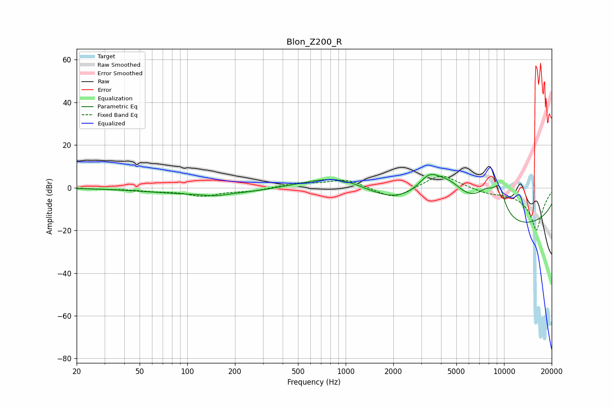

# Blon_Z200_R
See [usage instructions](https://github.com/jaakkopasanen/AutoEq#usage) for more options and info.

### Parametric EQs
Apply preamp of -6.3 dB when using parametric equalizer.

|   # | Type    |   Fc (Hz) |    Q |   Gain (dB) |
|-----|---------|-----------|------|-------------|
|   1 | Peaking |       150 | 2.51 |        -0.9 |
|   2 | Peaking |       266 | 0.25 |        -4.6 |
|   3 | Peaking |       926 | 0.48 |        12.8 |
|   4 | Peaking |      2084 | 0.58 |        -7.6 |
|   5 | Peaking |      3386 | 1.26 |        15.4 |
|   6 | Peaking |      4560 | 1.32 |         9.2 |
|   7 | Peaking |      7777 | 1.69 |        11.5 |
|   8 | Peaking |      9284 | 3.17 |         6.1 |
|   9 | Peaking |      9353 | 3.8  |         5.2 |
|  10 | Peaking |     10000 | 0.18 |       -20   |

### Fixed Band EQs
When using fixed band (also called graphic) equalizer, apply preamp of **-5.5 dB** (if available) and set gains manually with these parameters.

|   # | Type    |   Fc (Hz) |    Q |   Gain (dB) |
|-----|---------|-----------|------|-------------|
|   1 | Peaking |        31 | 1.41 |        -0.4 |
|   2 | Peaking |        62 | 1.41 |        -1.2 |
|   3 | Peaking |       125 | 1.41 |        -3.6 |
|   4 | Peaking |       250 | 1.41 |        -1.5 |
|   5 | Peaking |       500 | 1.41 |         2.1 |
|   6 | Peaking |      1000 | 1.41 |         4   |
|   7 | Peaking |      2000 | 1.41 |        -5.6 |
|   8 | Peaking |      4000 | 1.41 |         6.9 |
|   9 | Peaking |      8000 | 1.41 |        -1.9 |
|  10 | Peaking |     16000 | 1.41 |       -20   |

### Graphs

