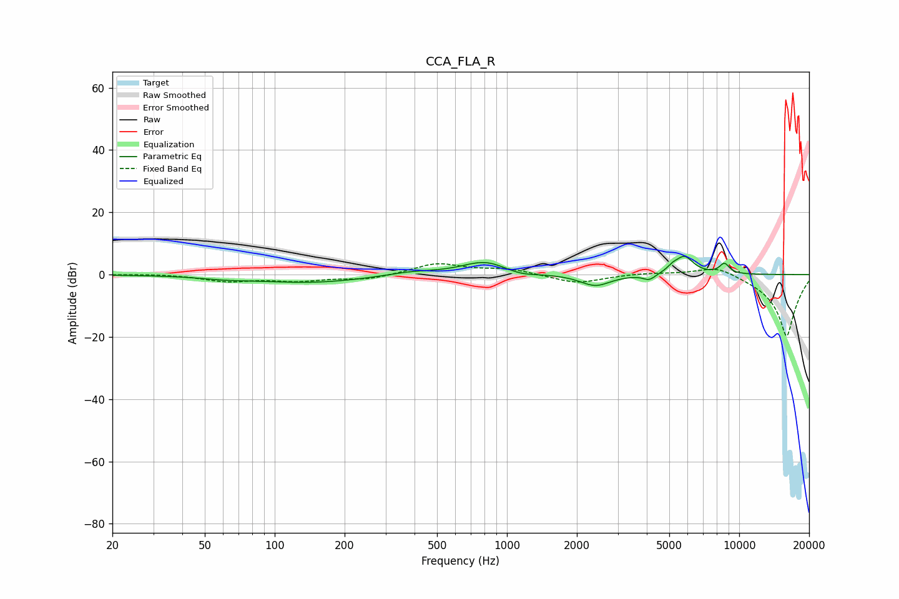

# CCA_FLA_R
See [usage instructions](https://github.com/jaakkopasanen/AutoEq#usage) for more options and info.

### Parametric EQs
Apply preamp of -6.0 dB when using parametric equalizer.

|   # | Type    |   Fc (Hz) |    Q |   Gain (dB) |
|-----|---------|-----------|------|-------------|
|   1 | Peaking |        61 | 1.43 |        -0.7 |
|   2 | Peaking |       142 | 0.57 |        -2.6 |
|   3 | Peaking |       385 | 1.28 |         1.2 |
|   4 | Peaking |       805 | 1.42 |         4.4 |
|   5 | Peaking |      1142 | 2.04 |        -1.3 |
|   6 | Peaking |      2402 | 2.16 |        -3.7 |
|   7 | Peaking |      4104 | 5.18 |        -1.9 |
|   8 | Peaking |      5172 | 6    |         1.3 |
|   9 | Peaking |      5809 | 3.47 |         5.7 |
|  10 | Peaking |      8636 | 6    |         3.2 |

### Fixed Band EQs
When using fixed band (also called graphic) equalizer, apply preamp of **-3.6 dB** (if available) and set gains manually with these parameters.

|   # | Type    |   Fc (Hz) |    Q |   Gain (dB) |
|-----|---------|-----------|------|-------------|
|   1 | Peaking |        31 | 1.41 |         0.3 |
|   2 | Peaking |        62 | 1.41 |        -2   |
|   3 | Peaking |       125 | 1.41 |        -1.8 |
|   4 | Peaking |       250 | 1.41 |        -1.6 |
|   5 | Peaking |       500 | 1.41 |         3.6 |
|   6 | Peaking |      1000 | 1.41 |         1.8 |
|   7 | Peaking |      2000 | 1.41 |        -2.9 |
|   8 | Peaking |      4000 | 1.41 |         0.6 |
|   9 | Peaking |      8000 | 1.41 |         3.4 |
|  10 | Peaking |     16000 | 1.41 |       -20   |

### Graphs

