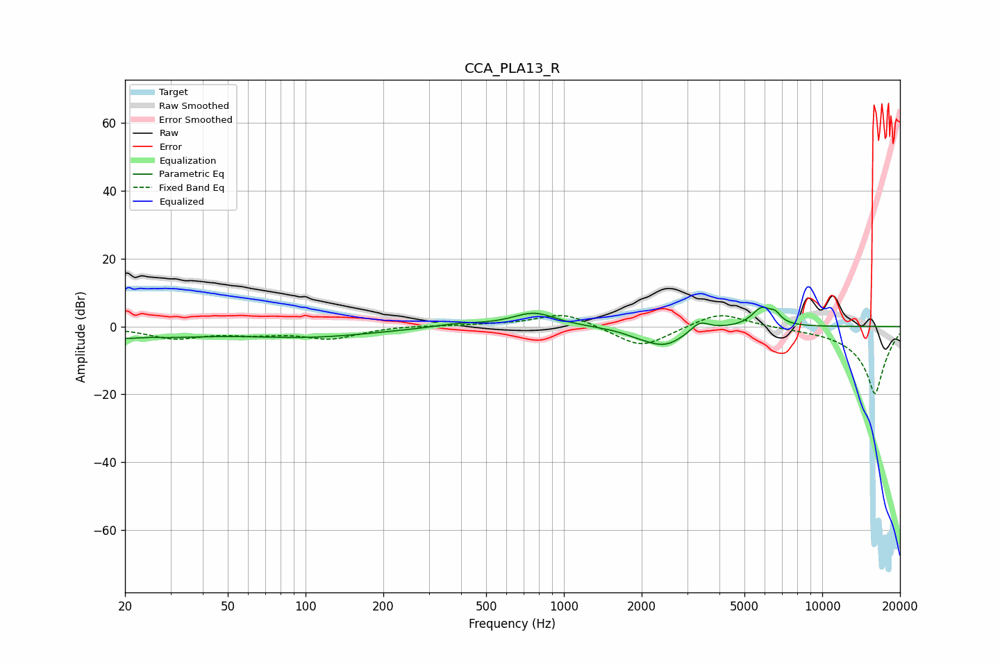

# CCA_PLA13_R
See [usage instructions](https://github.com/jaakkopasanen/AutoEq#usage) for more options and info.

### Parametric EQs
Apply preamp of -5.8 dB when using parametric equalizer.

|   # | Type    |   Fc (Hz) |    Q |   Gain (dB) |
|-----|---------|-----------|------|-------------|
|   1 | Peaking |        20 | 0.55 |        -3.3 |
|   2 | Peaking |        25 | 3.12 |         0.4 |
|   3 | Peaking |       105 | 0.55 |        -2.8 |
|   4 | Peaking |       387 | 1.51 |         1   |
|   5 | Peaking |       766 | 1.69 |         4.1 |
|   6 | Peaking |      1942 | 2.34 |        -1   |
|   7 | Peaking |      2459 | 1.74 |        -5.5 |
|   8 | Peaking |      3357 | 3.89 |         3   |
|   9 | Peaking |      5815 | 3.7  |         5.3 |
|  10 | Peaking |      6577 | 6    |         2.4 |

### Fixed Band EQs
When using fixed band (also called graphic) equalizer, apply preamp of **-3.3 dB** (if available) and set gains manually with these parameters.

|   # | Type    |   Fc (Hz) |    Q |   Gain (dB) |
|-----|---------|-----------|------|-------------|
|   1 | Peaking |        31 | 1.41 |        -3.3 |
|   2 | Peaking |        62 | 1.41 |        -1.7 |
|   3 | Peaking |       125 | 1.41 |        -3.4 |
|   4 | Peaking |       250 | 1.41 |         0.3 |
|   5 | Peaking |       500 | 1.41 |         0.4 |
|   6 | Peaking |      1000 | 1.41 |         4.2 |
|   7 | Peaking |      2000 | 1.41 |        -6.5 |
|   8 | Peaking |      4000 | 1.41 |         4.6 |
|   9 | Peaking |      8000 | 1.41 |        -0.1 |
|  10 | Peaking |     16000 | 1.41 |       -20   |

### Graphs

