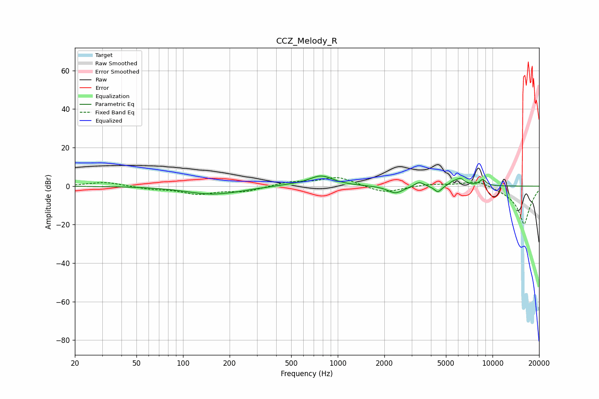

# CCZ_Melody_R
See [usage instructions](https://github.com/jaakkopasanen/AutoEq#usage) for more options and info.

### Parametric EQs
Apply preamp of -5.3 dB when using parametric equalizer.

|   # | Type    |   Fc (Hz) |    Q |   Gain (dB) |
|-----|---------|-----------|------|-------------|
|   1 | Peaking |       153 | 0.83 |        -4.1 |
|   2 | Peaking |       222 | 1.61 |        -0.3 |
|   3 | Peaking |       488 | 1.48 |         0.6 |
|   4 | Peaking |       780 | 1.81 |         5.4 |
|   5 | Peaking |      2357 | 2.86 |        -3.8 |
|   6 | Peaking |      3356 | 4.8  |         2.5 |
|   7 | Peaking |      4437 | 5.87 |        -3.4 |
|   8 | Peaking |      5501 | 6    |         1.3 |
|   9 | Peaking |      6176 | 4.37 |         3.7 |
|  10 | Peaking |      8649 | 6    |         3.2 |

### Fixed Band EQs
When using fixed band (also called graphic) equalizer, apply preamp of **-4.5 dB** (if available) and set gains manually with these parameters.

|   # | Type    |   Fc (Hz) |    Q |   Gain (dB) |
|-----|---------|-----------|------|-------------|
|   1 | Peaking |        31 | 1.41 |         2.2 |
|   2 | Peaking |        62 | 1.41 |        -1.3 |
|   3 | Peaking |       125 | 1.41 |        -3.8 |
|   4 | Peaking |       250 | 1.41 |        -2.6 |
|   5 | Peaking |       500 | 1.41 |         2.1 |
|   6 | Peaking |      1000 | 1.41 |         4.7 |
|   7 | Peaking |      2000 | 1.41 |        -3.7 |
|   8 | Peaking |      4000 | 1.41 |         1.2 |
|   9 | Peaking |      8000 | 1.41 |         3.6 |
|  10 | Peaking |     16000 | 1.41 |       -20   |

### Graphs

