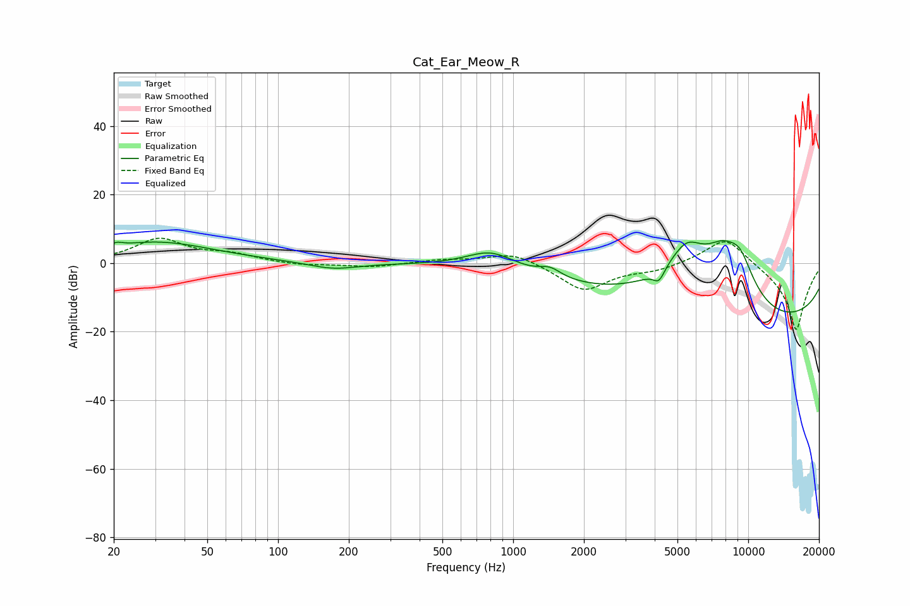

# Cat_Ear_Meow_R
See [usage instructions](https://github.com/jaakkopasanen/AutoEq#usage) for more options and info.

### Parametric EQs
Apply preamp of -6.7 dB when using parametric equalizer.

|   # | Type    |   Fc (Hz) |    Q |   Gain (dB) |
|-----|---------|-----------|------|-------------|
|   1 | Peaking |        21 | 5.51 |         1.1 |
|   2 | Peaking |        30 | 0.58 |         6.1 |
|   3 | Peaking |       171 | 1.34 |        -2   |
|   4 | Peaking |       807 | 1.27 |         5.9 |
|   5 | Peaking |      1436 | 2.91 |         2.7 |
|   6 | Peaking |      4174 | 6    |        -3.6 |
|   7 | Peaking |      5460 | 1.22 |        15.9 |
|   8 | Peaking |      7793 | 1.26 |        13   |
|   9 | Peaking |      9245 | 2.03 |         9.6 |
|  10 | Peaking |     10000 | 0.18 |       -20   |

### Fixed Band EQs
When using fixed band (also called graphic) equalizer, apply preamp of **-7.4 dB** (if available) and set gains manually with these parameters.

|   # | Type    |   Fc (Hz) |    Q |   Gain (dB) |
|-----|---------|-----------|------|-------------|
|   1 | Peaking |        31 | 1.41 |         6.9 |
|   2 | Peaking |        62 | 1.41 |         2.2 |
|   3 | Peaking |       125 | 1.41 |        -0.8 |
|   4 | Peaking |       250 | 1.41 |        -1.2 |
|   5 | Peaking |       500 | 1.41 |         0.9 |
|   6 | Peaking |      1000 | 1.41 |         3.4 |
|   7 | Peaking |      2000 | 1.41 |        -8.1 |
|   8 | Peaking |      4000 | 1.41 |        -1.8 |
|   9 | Peaking |      8000 | 1.41 |         8.5 |
|  10 | Peaking |     16000 | 1.41 |       -20   |

### Graphs

