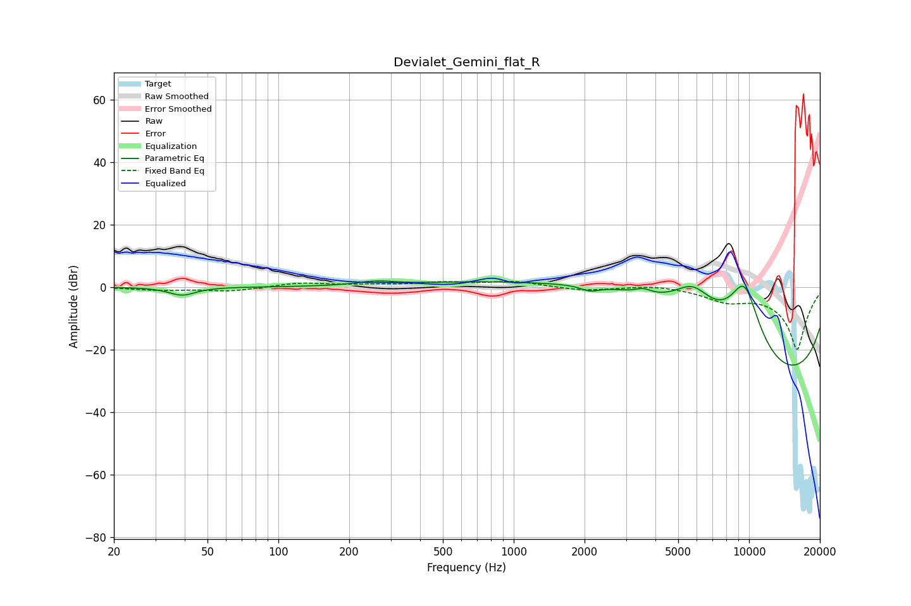

# Devialet_Gemini_flat_R
See [usage instructions](https://github.com/jaakkopasanen/AutoEq#usage) for more options and info.

### Parametric EQs
Apply preamp of -2.0 dB when using parametric equalizer.

|   # | Type    |   Fc (Hz) |    Q |   Gain (dB) |
|-----|---------|-----------|------|-------------|
|   1 | Peaking |        39 | 2.57 |        -2.6 |
|   2 | Peaking |       259 | 1.77 |         1.3 |
|   3 | Peaking |      2108 | 3.47 |        -1.8 |
|   4 | Peaking |      2570 | 0.36 |        14.6 |
|   5 | Peaking |      3551 | 4.08 |         1.6 |
|   6 | Peaking |      5763 | 0.96 |        17.7 |
|   7 | Peaking |      9556 | 1.67 |        11.6 |
|   8 | Peaking |      9567 | 1.66 |        11.6 |
|   9 | Peaking |     10000 | 0.18 |       -17.8 |
|  10 | Peaking |     10000 | 0.18 |       -17.8 |

### Fixed Band EQs
When using fixed band (also called graphic) equalizer, apply preamp of **-1.9 dB** (if available) and set gains manually with these parameters.

|   # | Type    |   Fc (Hz) |    Q |   Gain (dB) |
|-----|---------|-----------|------|-------------|
|   1 | Peaking |        31 | 1.41 |        -0.9 |
|   2 | Peaking |        62 | 1.41 |        -1.3 |
|   3 | Peaking |       125 | 1.41 |         1.3 |
|   4 | Peaking |       250 | 1.41 |         0.6 |
|   5 | Peaking |       500 | 1.41 |         1.3 |
|   6 | Peaking |      1000 | 1.41 |         1.7 |
|   7 | Peaking |      2000 | 1.41 |        -1.2 |
|   8 | Peaking |      4000 | 1.41 |         0.8 |
|   9 | Peaking |      8000 | 1.41 |        -3.6 |
|  10 | Peaking |     16000 | 1.41 |       -20   |

### Graphs

