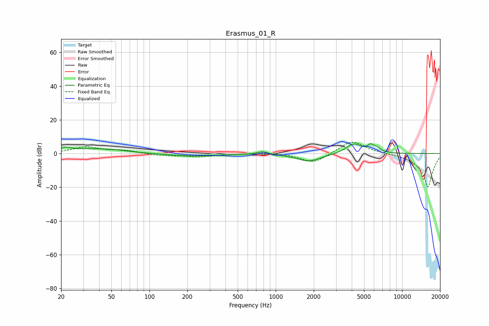

# Erasmus_01_R
See [usage instructions](https://github.com/jaakkopasanen/AutoEq#usage) for more options and info.

### Parametric EQs
Apply preamp of -5.9 dB when using parametric equalizer.

|   # | Type    |   Fc (Hz) |    Q |   Gain (dB) |
|-----|---------|-----------|------|-------------|
|   1 | Peaking |        22 | 4.72 |         3.6 |
|   2 | Peaking |        22 | 6    |        -2   |
|   3 | Peaking |        31 | 0.64 |         2.5 |
|   4 | Peaking |        53 | 1.29 |         0.8 |
|   5 | Peaking |       217 | 0.75 |        -1.5 |
|   6 | Peaking |       787 | 3.41 |         1.7 |
|   7 | Peaking |      1829 | 1.41 |        -4.6 |
|   8 | Peaking |      4145 | 2.24 |         5.9 |
|   9 | Peaking |      5651 | 5.74 |         3.4 |
|  10 | Peaking |      6347 | 4.44 |         2.2 |

### Fixed Band EQs
When using fixed band (also called graphic) equalizer, apply preamp of **-6.8 dB** (if available) and set gains manually with these parameters.

|   # | Type    |   Fc (Hz) |    Q |   Gain (dB) |
|-----|---------|-----------|------|-------------|
|   1 | Peaking |        31 | 1.41 |         3.7 |
|   2 | Peaking |        62 | 1.41 |         1.7 |
|   3 | Peaking |       125 | 1.41 |        -1.2 |
|   4 | Peaking |       250 | 1.41 |        -1.9 |
|   5 | Peaking |       500 | 1.41 |        -0.1 |
|   6 | Peaking |      1000 | 1.41 |         0.7 |
|   7 | Peaking |      2000 | 1.41 |        -6   |
|   8 | Peaking |      4000 | 1.41 |         8.1 |
|   9 | Peaking |      8000 | 1.41 |         0.2 |
|  10 | Peaking |     16000 | 1.41 |       -20   |

### Graphs

