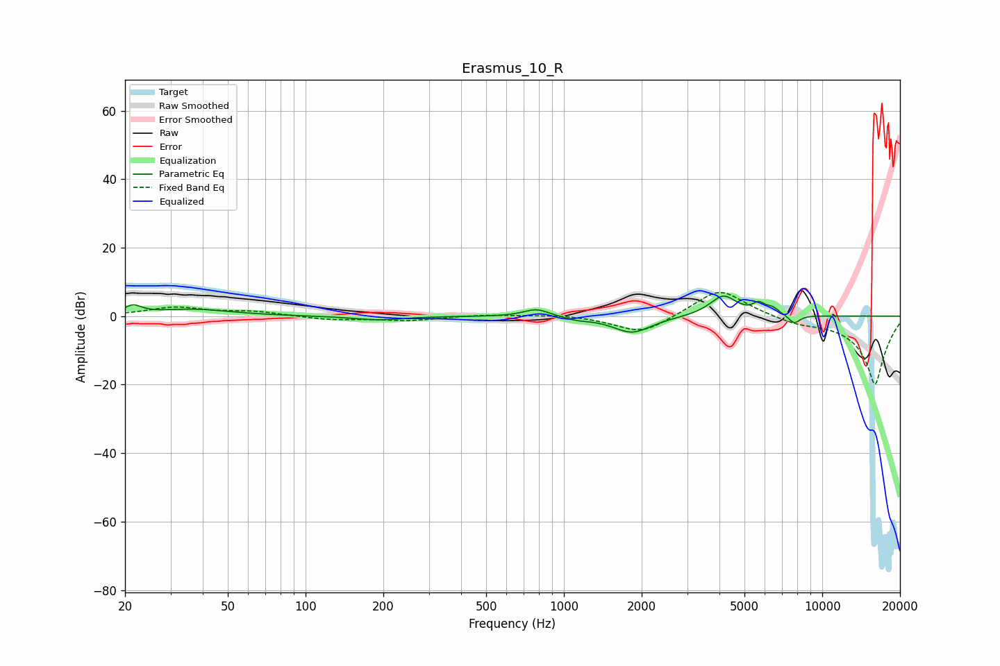

# Erasmus_10_R
See [usage instructions](https://github.com/jaakkopasanen/AutoEq#usage) for more options and info.

### Parametric EQs
Apply preamp of -5.9 dB when using parametric equalizer.

|   # | Type    |   Fc (Hz) |    Q |   Gain (dB) |
|-----|---------|-----------|------|-------------|
|   1 | Peaking |        21 | 4.32 |         2.4 |
|   2 | Peaking |        37 | 0.99 |         2   |
|   3 | Peaking |       190 | 1.5  |        -1.1 |
|   4 | Peaking |       783 | 2.8  |         2.3 |
|   5 | Peaking |      1117 | 3.09 |        -0.7 |
|   6 | Peaking |      1837 | 1.87 |        -4.9 |
|   7 | Peaking |      4139 | 2.65 |         6.1 |
|   8 | Peaking |      5681 | 5.98 |         2.6 |
|   9 | Peaking |      6409 | 5.12 |         1.8 |
|  10 | Peaking |      7795 | 5.88 |        -2.5 |

### Fixed Band EQs
When using fixed band (also called graphic) equalizer, apply preamp of **-7.0 dB** (if available) and set gains manually with these parameters.

|   # | Type    |   Fc (Hz) |    Q |   Gain (dB) |
|-----|---------|-----------|------|-------------|
|   1 | Peaking |        31 | 1.41 |         2.5 |
|   2 | Peaking |        62 | 1.41 |         1.3 |
|   3 | Peaking |       125 | 1.41 |        -1   |
|   4 | Peaking |       250 | 1.41 |        -1.2 |
|   5 | Peaking |       500 | 1.41 |         0.5 |
|   6 | Peaking |      1000 | 1.41 |         0.6 |
|   7 | Peaking |      2000 | 1.41 |        -5.4 |
|   8 | Peaking |      4000 | 1.41 |         8.5 |
|   9 | Peaking |      8000 | 1.41 |        -1.7 |
|  10 | Peaking |     16000 | 1.41 |       -20   |

### Graphs

