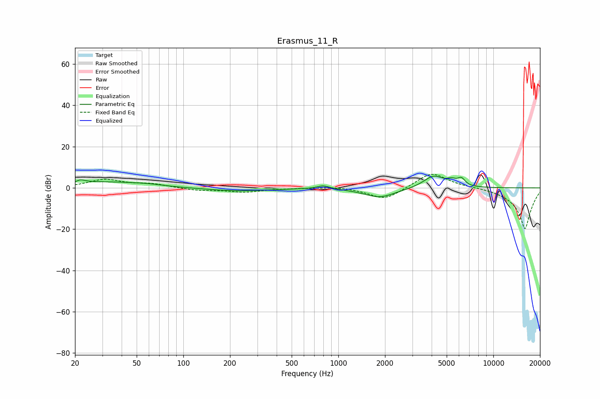

# Erasmus_11_R
See [usage instructions](https://github.com/jaakkopasanen/AutoEq#usage) for more options and info.

### Parametric EQs
Apply preamp of -5.8 dB when using parametric equalizer.

|   # | Type    |   Fc (Hz) |    Q |   Gain (dB) |
|-----|---------|-----------|------|-------------|
|   1 | Peaking |        22 | 5.25 |         3.6 |
|   2 | Peaking |        22 | 6    |        -2.1 |
|   3 | Peaking |        31 | 0.64 |         2.7 |
|   4 | Peaking |        58 | 1.34 |         0.8 |
|   5 | Peaking |       225 | 0.74 |        -1.5 |
|   6 | Peaking |       799 | 3.44 |         1.7 |
|   7 | Peaking |      1849 | 1.37 |        -4.6 |
|   8 | Peaking |      4106 | 2.15 |         5.9 |
|   9 | Peaking |      5389 | 4.41 |         2.3 |
|  10 | Peaking |      6224 | 5.7  |         3.4 |

### Fixed Band EQs
When using fixed band (also called graphic) equalizer, apply preamp of **-6.7 dB** (if available) and set gains manually with these parameters.

|   # | Type    |   Fc (Hz) |    Q |   Gain (dB) |
|-----|---------|-----------|------|-------------|
|   1 | Peaking |        31 | 1.41 |         3.9 |
|   2 | Peaking |        62 | 1.41 |         1.7 |
|   3 | Peaking |       125 | 1.41 |        -1.2 |
|   4 | Peaking |       250 | 1.41 |        -1.9 |
|   5 | Peaking |       500 | 1.41 |        -0.1 |
|   6 | Peaking |      1000 | 1.41 |         0.7 |
|   7 | Peaking |      2000 | 1.41 |        -6   |
|   8 | Peaking |      4000 | 1.41 |         7.9 |
|   9 | Peaking |      8000 | 1.41 |         0.4 |
|  10 | Peaking |     16000 | 1.41 |       -20   |

### Graphs

