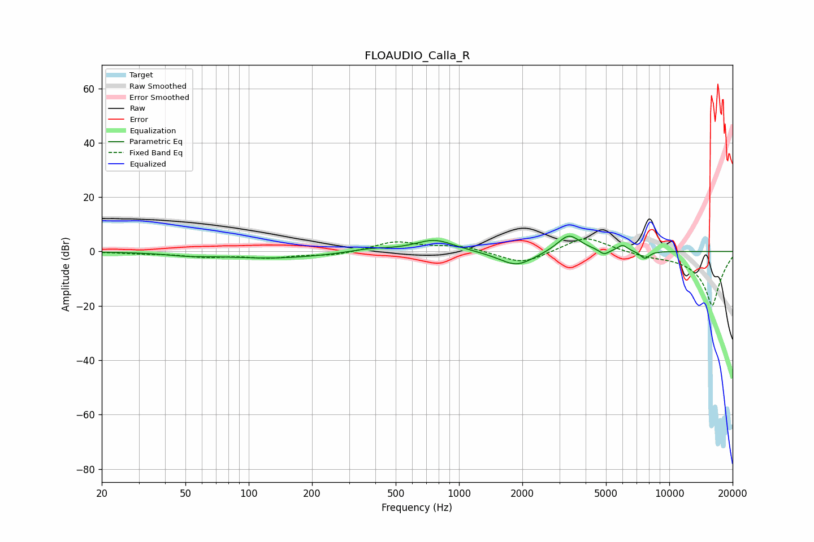

# FLOAUDIO_Calla_R
See [usage instructions](https://github.com/jaakkopasanen/AutoEq#usage) for more options and info.

### Parametric EQs
Apply preamp of -5.7 dB when using parametric equalizer.

|   # | Type    |   Fc (Hz) |    Q |   Gain (dB) |
|-----|---------|-----------|------|-------------|
|   1 | Peaking |        51 | 1.55 |        -0.8 |
|   2 | Peaking |       131 | 0.54 |        -2.4 |
|   3 | Peaking |       375 | 1.45 |         1.3 |
|   4 | Peaking |       764 | 1.5  |         4.5 |
|   5 | Peaking |      1868 | 1.72 |        -4.4 |
|   6 | Peaking |      1937 | 1.43 |        -1.1 |
|   7 | Peaking |      3330 | 2.51 |         6.7 |
|   8 | Peaking |      4896 | 6    |        -2   |
|   9 | Peaking |      5991 | 5.91 |         2.3 |
|  10 | Peaking |      7650 | 5.98 |        -2.8 |

### Fixed Band EQs
When using fixed band (also called graphic) equalizer, apply preamp of **-4.7 dB** (if available) and set gains manually with these parameters.

|   # | Type    |   Fc (Hz) |    Q |   Gain (dB) |
|-----|---------|-----------|------|-------------|
|   1 | Peaking |        31 | 1.41 |        -0.6 |
|   2 | Peaking |        62 | 1.41 |        -1.7 |
|   3 | Peaking |       125 | 1.41 |        -2   |
|   4 | Peaking |       250 | 1.41 |        -1.4 |
|   5 | Peaking |       500 | 1.41 |         3.6 |
|   6 | Peaking |      1000 | 1.41 |         2   |
|   7 | Peaking |      2000 | 1.41 |        -4.8 |
|   8 | Peaking |      4000 | 1.41 |         5.9 |
|   9 | Peaking |      8000 | 1.41 |        -1.1 |
|  10 | Peaking |     16000 | 1.41 |       -20   |

### Graphs

