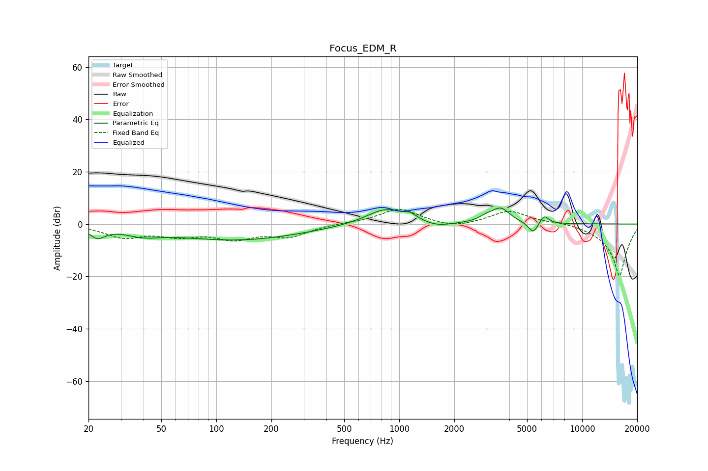

# Focus_EDM_R
See [usage instructions](https://github.com/jaakkopasanen/AutoEq#usage) for more options and info.

### Parametric EQs
Apply preamp of -6.2 dB when using parametric equalizer.

|   # | Type    |   Fc (Hz) |    Q |   Gain (dB) |
|-----|---------|-----------|------|-------------|
|   1 | Peaking |        22 | 3.41 |        -3.9 |
|   2 | Peaking |        40 | 1.51 |        -2.5 |
|   3 | Peaking |       130 | 0.39 |        -6.1 |
|   4 | Peaking |       843 | 1.3  |         6.3 |
|   5 | Peaking |      1151 | 4.18 |         1.8 |
|   6 | Peaking |      1608 | 1.85 |        -1.8 |
|   7 | Peaking |      2974 | 3.8  |         1.5 |
|   8 | Peaking |      3584 | 2.77 |         5.7 |
|   9 | Peaking |      5409 | 5    |        -4.4 |
|  10 | Peaking |      6186 | 5.49 |         3.5 |

### Fixed Band EQs
When using fixed band (also called graphic) equalizer, apply preamp of **-5.6 dB** (if available) and set gains manually with these parameters.

|   # | Type    |   Fc (Hz) |    Q |   Gain (dB) |
|-----|---------|-----------|------|-------------|
|   1 | Peaking |        31 | 1.41 |        -4.7 |
|   2 | Peaking |        62 | 1.41 |        -3.7 |
|   3 | Peaking |       125 | 1.41 |        -4.9 |
|   4 | Peaking |       250 | 1.41 |        -4.4 |
|   5 | Peaking |       500 | 1.41 |         0.3 |
|   6 | Peaking |      1000 | 1.41 |         5.9 |
|   7 | Peaking |      2000 | 1.41 |        -1.8 |
|   8 | Peaking |      4000 | 1.41 |         5.2 |
|   9 | Peaking |      8000 | 1.41 |         0.9 |
|  10 | Peaking |     16000 | 1.41 |       -20   |

### Graphs

