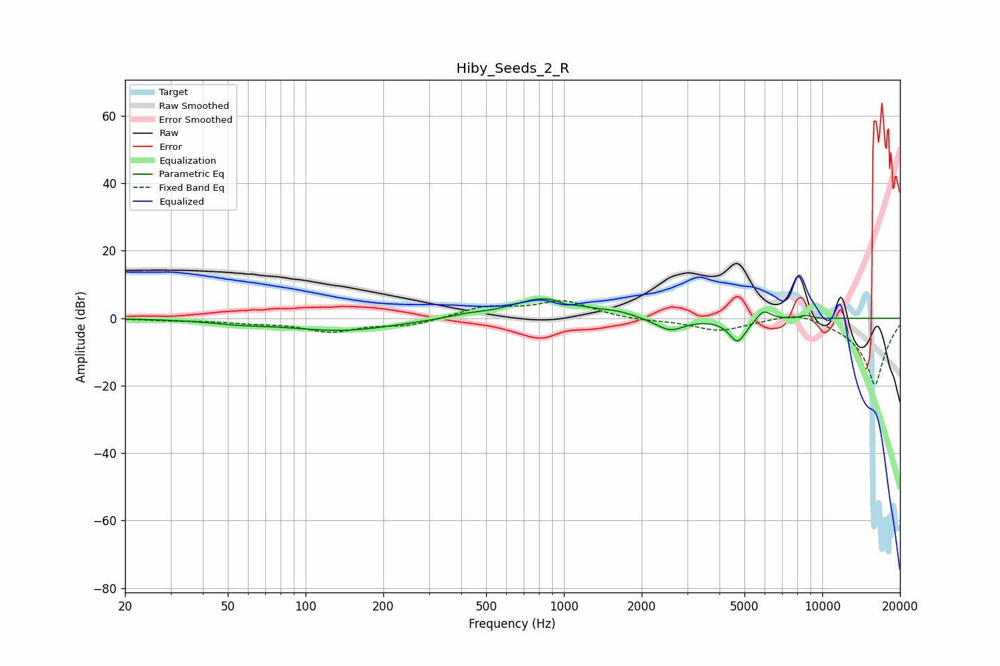

# Hiby_Seeds_2_R
See [usage instructions](https://github.com/jaakkopasanen/AutoEq#usage) for more options and info.

### Parametric EQs
Apply preamp of -5.9 dB when using parametric equalizer.

|   # | Type    |   Fc (Hz) |    Q |   Gain (dB) |
|-----|---------|-----------|------|-------------|
|   1 | Peaking |        55 | 1.23 |        -1   |
|   2 | Peaking |       139 | 0.68 |        -3.6 |
|   3 | Peaking |       414 | 2.22 |         0.7 |
|   4 | Peaking |       852 | 1.1  |         6.2 |
|   5 | Peaking |      1013 | 4.26 |        -1   |
|   6 | Peaking |      1620 | 2.44 |         0.9 |
|   7 | Peaking |      2572 | 2.46 |        -3.9 |
|   8 | Peaking |      4704 | 4.14 |        -7   |
|   9 | Peaking |      5932 | 4.93 |         3.1 |
|  10 | Peaking |      8642 | 6    |         0.9 |

### Fixed Band EQs
When using fixed band (also called graphic) equalizer, apply preamp of **-5.3 dB** (if available) and set gains manually with these parameters.

|   # | Type    |   Fc (Hz) |    Q |   Gain (dB) |
|-----|---------|-----------|------|-------------|
|   1 | Peaking |        31 | 1.41 |        -0.5 |
|   2 | Peaking |        62 | 1.41 |        -1   |
|   3 | Peaking |       125 | 1.41 |        -3.7 |
|   4 | Peaking |       250 | 1.41 |        -2.1 |
|   5 | Peaking |       500 | 1.41 |         3.2 |
|   6 | Peaking |      1000 | 1.41 |         4.9 |
|   7 | Peaking |      2000 | 1.41 |        -0.7 |
|   8 | Peaking |      4000 | 1.41 |        -3.6 |
|   9 | Peaking |      8000 | 1.41 |         2.7 |
|  10 | Peaking |     16000 | 1.41 |       -20   |

### Graphs

