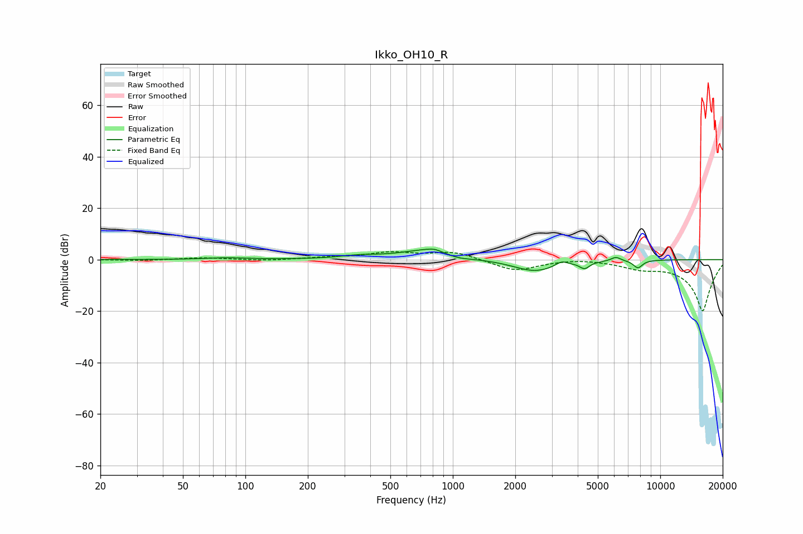

# Ikko_OH10_R
See [usage instructions](https://github.com/jaakkopasanen/AutoEq#usage) for more options and info.

### Parametric EQs
Apply preamp of -4.2 dB when using parametric equalizer.

|   # | Type    |   Fc (Hz) |    Q |   Gain (dB) |
|-----|---------|-----------|------|-------------|
|   1 | Peaking |        81 | 1.5  |         0.7 |
|   2 | Peaking |       354 | 1.58 |         1.1 |
|   3 | Peaking |       780 | 1.09 |         4.2 |
|   4 | Peaking |       816 | 4.47 |         0.8 |
|   5 | Peaking |      1045 | 1.99 |        -1.6 |
|   6 | Peaking |      2487 | 1.31 |        -4.7 |
|   7 | Peaking |      3341 | 4.89 |         1.9 |
|   8 | Peaking |      4317 | 5.99 |        -2.5 |
|   9 | Peaking |      6112 | 6    |         1.6 |
|  10 | Peaking |      7804 | 5.94 |        -3.1 |

### Fixed Band EQs
When using fixed band (also called graphic) equalizer, apply preamp of **-3.2 dB** (if available) and set gains manually with these parameters.

|   # | Type    |   Fc (Hz) |    Q |   Gain (dB) |
|-----|---------|-----------|------|-------------|
|   1 | Peaking |        31 | 1.41 |        -0.4 |
|   2 | Peaking |        62 | 1.41 |         0.8 |
|   3 | Peaking |       125 | 1.41 |        -0.5 |
|   4 | Peaking |       250 | 1.41 |         0.7 |
|   5 | Peaking |       500 | 1.41 |         2.5 |
|   6 | Peaking |      1000 | 1.41 |         3   |
|   7 | Peaking |      2000 | 1.41 |        -4.4 |
|   8 | Peaking |      4000 | 1.41 |         0.6 |
|   9 | Peaking |      8000 | 1.41 |        -2.5 |
|  10 | Peaking |     16000 | 1.41 |       -20   |

### Graphs

